## Design Patterns

```mermaid
classDiagram

    %% HEXAGONAL - Ports and Adapters
    class StartGameUseCase {
        <<interface>>
        +play()
    }
    class DiceShaker {
        <<interface>>
        +roll() DiceRoll
        +reset()
    }
    class Board {
        <<interface>>
        +createBoard(playerCount) BoardFactory
    }
    class GameSessionUseCase {
        +play()
    }
    class RandomDiceShakerAdapter {
        +roll() DiceRoll
    }
    class FixedDiceShakerAdapter {
        +roll() DiceRoll
        +reset()
    }
    class BoardFactoryAdapter {
        +createBoard(playerCount) BoardFactory
    }

    GameSessionUseCase ..|> StartGameUseCase : implements
    RandomDiceShakerAdapter ..|> DiceShaker : implements
    FixedDiceShakerAdapter ..|> DiceShaker : implements
    BoardFactoryAdapter ..|> Board : implements

    %% DECORATOR - Movement
    class Movement {
        <<interface>>
        +move(player, roll) TurnOutcome
    }
    class BasicMovement {
        +move(player, roll) TurnOutcome
    }
    class MovementDecorator {
        <<abstract>>
        #wrapped Movement
        +move(player, roll) TurnOutcome
    }
    class TeleportVariationDecorator {
        +move(player, roll) TurnOutcome
    }
    class ExactEndVariationDecorator {
        +move(player, roll) TurnOutcome
    }
    class HitVariationDecorator {
        +move(player, roll) TurnOutcome
    }

    BasicMovement ..|> Movement : implements
    MovementDecorator ..|> Movement : implements
    MovementDecorator o-- Movement : wraps
    TeleportVariationDecorator --|> MovementDecorator : extends
    ExactEndVariationDecorator --|> MovementDecorator : extends
    HitVariationDecorator --|> MovementDecorator : extends

    %% STRATEGY - Rule Selection
    class RuleSelectionStrategy {
        <<interface>>
        +select(availableRules) List~GameRule~
    }
    class RandomRuleSelection {
        +select(availableRules) List~GameRule~
    }
    class FixedRuleSelection {
        +select(availableRules) List~GameRule~
    }
    class MovementDecoratorStrategy {
        <<interface>>
        +supports(rule) boolean
        +decorate(movement, rule) Movement
    }
    class TeleportVariation {
        +supports(rule) boolean
        +decorate(movement, rule) Movement
    }
    class ExactEndVariation {
        +supports(rule) boolean
        +decorate(movement, rule) Movement
    }
    class HitVariation {
        +supports(rule) boolean
        +decorate(movement, rule) Movement
    }

    RandomRuleSelection ..|> RuleSelectionStrategy : implements
    FixedRuleSelection ..|> RuleSelectionStrategy : implements
    TeleportVariation ..|> MovementDecoratorStrategy : implements
    ExactEndVariation ..|> MovementDecoratorStrategy : implements
    HitVariation ..|> MovementDecoratorStrategy : implements

    %% STATE - Game Lifecycle
    class GameState {
        <<interface>>
        +handle(player, playerTurn)
        +isGameOver() boolean
        +nextState() GameState
    }
    class InPlayState {
        +handle(player, playerTurn)
        +isGameOver() boolean
        +nextState() GameState
    }
    class GameOverState {
        +handle(player, playerTurn)
        +isGameOver() boolean
        +getWinner() Player
    }

    InPlayState ..|> GameState : implements
    GameOverState ..|> GameState : implements
    InPlayState --> GameOverState : transitions to

    %% OBSERVER - Game Events
    class PlayerTurnObserverPort {
        <<interface>>
        +onTurnPlayed(playerTurn)
    }
    class GameOverObserverPort {
        <<interface>>
        +onGameOver(playerTurn)
    }
    class GameStartObserverPort {
        <<interface>>
        +onGameStarted(players)
    }
    class TurnDisplayAdapter {
        +onTurnPlayed(playerTurn)
    }
    class GameOverDisplayAdapter {
        +onGameOver(playerTurn)
    }
    class PathsDisplayAdapter {
        +onGameStarted(players)
    }

    TurnDisplayAdapter ..|> PlayerTurnObserverPort : implements
    GameOverDisplayAdapter ..|> GameOverObserverPort : implements
    PathsDisplayAdapter ..|> GameStartObserverPort : implements

    %% FACTORY + TEMPLATE METHOD - Board and Dice
    class BoardFactory {
        <<interface>>
        +getSize() int
        +getPositions() List~Position~
    }
    class AbstractBoard {
        <<abstract>>
        +getPositions() List~Position~
        +indexOf(position) int
        +getPosition(index) Position
    }
    class SmallBoard {
        +getSize() int
        +getCols() int
    }
    class LargeBoard {
        +getSize() int
        +getCols() int
    }
    class AbstractDiceShaker {
        <<abstract>>
        #singleDie() int
        +roll() DiceRoll
    }
    class RandomSingleDiceShaker {
        +toArray() int[]
    }
    class RandomDoubleDiceShaker {
        +toArray() int[]
    }
    class FixedSingleDiceShaker {
        +toArray() int[]
        +reset()
    }

    AbstractBoard ..|> BoardFactory : implements
    SmallBoard --|> AbstractBoard : extends
    LargeBoard --|> AbstractBoard : extends
    BoardFactoryAdapter ..> SmallBoard : creates
    BoardFactoryAdapter ..> LargeBoard : creates
    RandomSingleDiceShaker --|> AbstractDiceShaker : extends
    RandomDoubleDiceShaker --|> AbstractDiceShaker : extends
    FixedSingleDiceShaker --|> AbstractDiceShaker : extends
```

### Hexagonal Architecture (Ports & Adapters)
The core game logic has no knowledge of how it is driven or what external services it depends on. Inbound ports such as `StartGameUseCase` define what actions can be triggered, and outbound ports such as `DiceShaker` and `Board` define what the application needs from the outside world. Concrete adapters in the infrastructure layer implement these ports, so swapping the console for a UI, or a real dice shaker for a fixed test one, requires no changes to the domain.

### Decorator Pattern
`BasicMovement` handles a standard move by advancing the player along their path by the dice roll total. Each active game rule wraps this in a decorator — `TeleportVariationDecorator`, `ExactEndVariationDecorator`, and `HitVariationDecorator` — that adds its own behaviour around the delegate call. This allows any combination of rules to be layered onto the movement pipeline at runtime without modifying existing classes.

### Strategy Pattern
`RuleSelectionStrategy` allows the algorithm for choosing which rules are active to vary independently — `RandomRuleSelection` shuffles and picks a random subset, while `FixedRuleSelection` uses a predetermined list. `MovementDecoratorStrategy` works similarly for applying rules to movement: each strategy declares which rule type it supports via `supports()` and knows how to wrap the current movement with the correct decorator via `decorate()`.

### State Pattern
The game progresses through two states: `InPlayState` and `GameOverState`, both implementing the `GameState` interface. After each turn `InPlayState` checks whether the current player has reached the end of their path, and if so transitions to `GameOverState` by returning it from `nextState()`. The game loop in `PlayerTurn` simply calls `isGameOver()` each round, with no conditional logic about which state it is in.

### Observer Pattern
Three observer ports — `PlayerTurnObserverPort`, `GameOverObserverPort`, and `GameStartObserverPort` — allow the domain to broadcast events without knowing who is listening. The infrastructure display adapters register themselves and react by printing output to the console. Adding a new output target such as a file logger or a UI requires only a new adapter implementing the relevant port, with no changes to the domain.

### Factory Pattern
`BoardFactoryAdapter` implements the `Board` port and acts as a factory, selecting either `SmallBoard` or `LargeBoard` based on the player count passed in. Both board types extend `AbstractBoard`, which provides the shared position list logic, with each subclass supplying its own grid layout and dimensions.

### Template Method Pattern
`AbstractDiceShaker` defines the overall algorithm for rolling dice — calling `toArray()` and wrapping the result in a `DiceRoll` — but leaves the implementation of `toArray()` to its subclasses. `RandomSingleDiceShaker` rolls one die, `RandomDoubleDiceShaker` rolls two, and `FixedSingleDiceShaker` returns a predetermined sequence. The rolling logic is written once in the abstract class and never repeated.