# HyperJump
Introduction Here

# Architecture Evaluation

The architecture of HyperJump follows a modular and loosely coupled structure that separates the application into multiple layers and responsibilities. The system is heavily influenced by Hexagonal Architecture, where communication occurs through interfaces (ports) and concrete implementations (adapters).

### Game
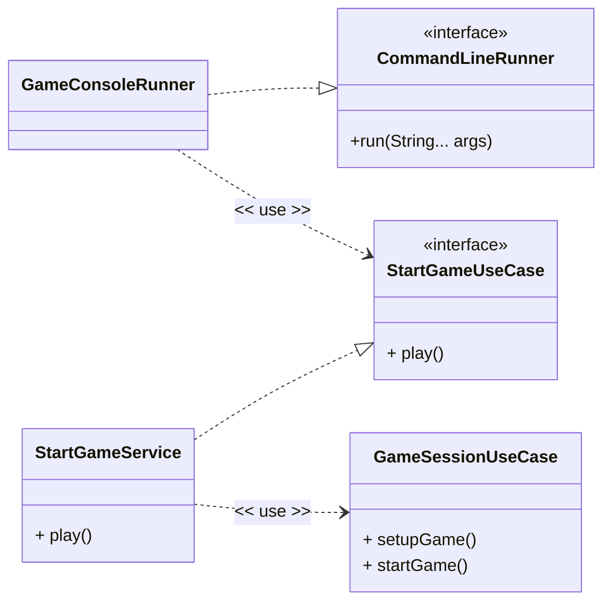

## Strengths of the Architecture

### Separation of Concerns

The project cleanly separates:
- Application logic
- Domain/game logic
- Infrastructure implementations
- User interaction

This improves readability and maintainability because each component has a clearly defined responsibility.

### Loose Coupling Through Interfaces

Interfaces such as:
- `StartGameUseCase`
- `SavedGameRepository`
- Observer ports
- Board
- DiceShaker
- Rule

allow the core game logic to remain independent from implementation details. This improves flexibility and testability.

### Extensibility

The architecture allows additional features to be added without modifying existing core logic. Examples include:
- Adding new board types
- Introducing new movement rules
- Supporting alternative storage systems
- Creating graphical interfaces instead of console adapters

### Testability

Because dependencies are injected through abstractions, components can be mocked or replaced during testing. This improves unit testing capabilities and reduces dependency on infrastructure implementations.

### Replay and Persistence Support
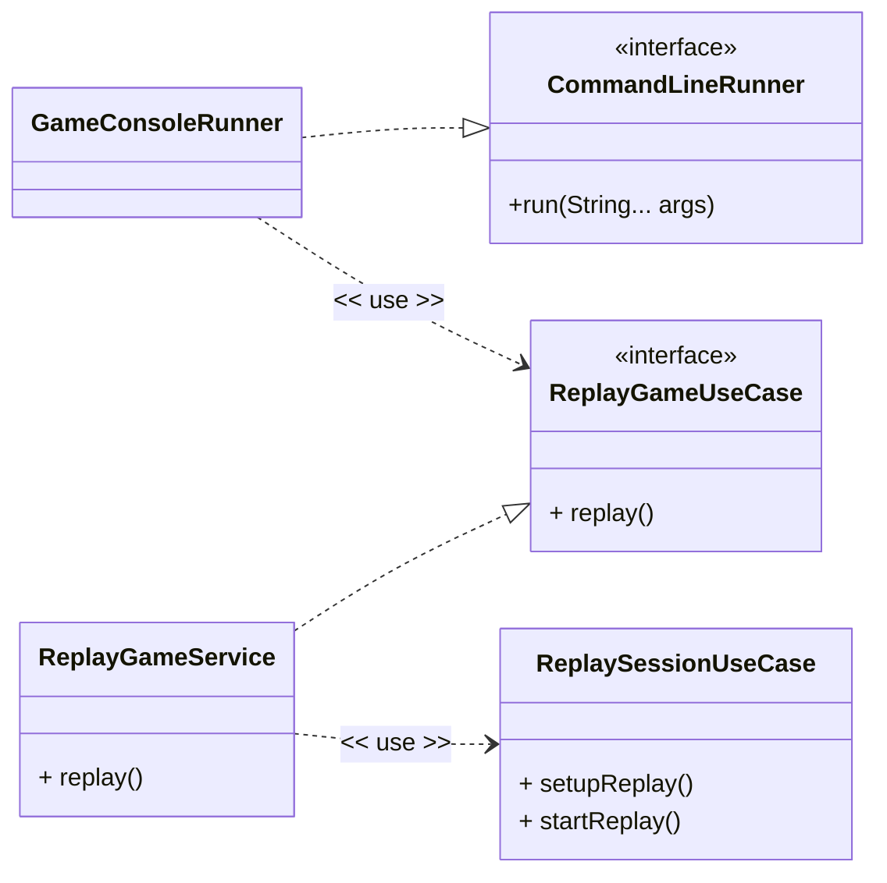
The replay subsystem demonstrates strong architectural separation by isolating replay functionality from standard gameplay. Repository abstractions also support multiple persistence strategies.

---

### Components

#### GameConsoleRunner
- Acts as the application's entry point.
- Implements Spring Boot’s `CommandLineRunner`.
- Executes automatically when the application starts.

#### CommandLineRunner
- Spring Boot interface used to run console-based applications.

#### StartGameUseCase
- Input port of the application.
- Defines the behaviour exposed to external layers through:

```text
play()
```

#### StartGameService
- Concrete implementation of `StartGameUseCase`.
- Responsible for orchestrating the game startup process.

#### GameSessionUseCase
- Coordinates the core gameplay lifecycle.
- Handles:
    - `setupGame()`
    - `startGame()`

### Execution Flow

```text
Spring Boot Application
        ↓
GameConsoleRunner.run()
        ↓
StartGameUseCase.play()
        ↓
StartGameService
        ↓
GameSessionUseCase
        ↓
Game setup and gameplay execution
```

### Architectural Concepts Demonstrated

- Clean Architecture
- Dependency Inversion Principle
- Input Port Pattern
- Use Case Orchestration
- Separation of Concerns
- Framework-independent business logic

## Board Adapter
This diagram represents the board creation and board hierarchy used within the game.

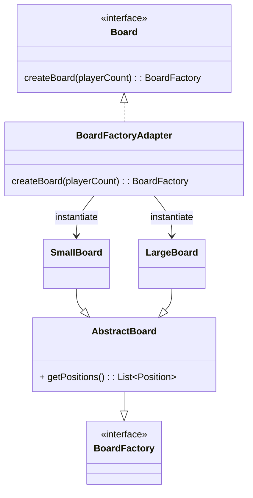

- `Board` acts as the output port used by the application layer.
- `BoardFactoryAdapter` is the driven adapter responsible for creating the correct board implementation.
- `SmallBoard` and `LargeBoard` are concrete board implementations.
- `AbstractBoard` contains shared board behaviour such as:
    - board generation
    - retrieving positions
    - retrieving column counts
- `BoardFactory` defines the common abstraction for all board implementations.

### Architectural Concepts

- Ports and Adapters Architecture
- Adapter Pattern
- Factory Pattern
- Template Method / Abstract Base Class pattern
- Polymorphism
- Shared domain behaviour reuse

## DiceShaker Adapter 
This diagram represents the dice rolling system used for gameplay and testing.

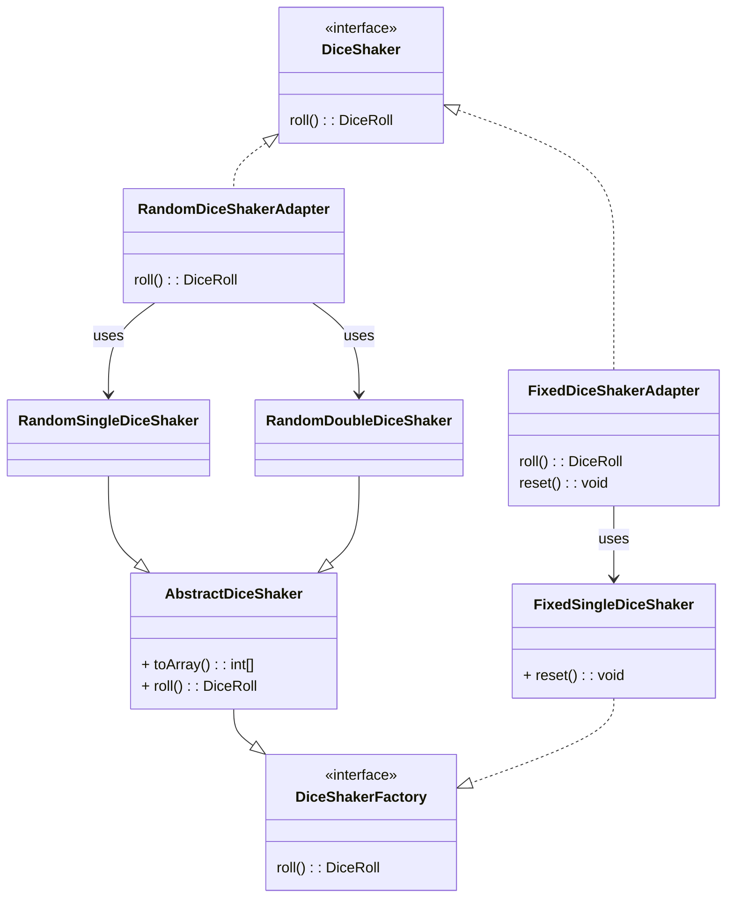

- `DiceShaker` acts as the output port used by the application layer.
- `RandomDiceShakerAdapter` provides random gameplay behaviour.
- `FixedDiceShakerAdapter` provides deterministic behaviour for testing and replayable game states.
- `RandomSingleDiceShaker` and `RandomDoubleDiceShaker` inherit shared rolling logic from `AbstractDiceShaker`.
- `FixedSingleDiceShaker` implements fixed deterministic rolling behaviour independently.

### Architectural Concepts

- Ports and Adapters Architecture
- Adapter Pattern
- Strategy Pattern
- Template Method / Abstract Base Class pattern
- Runtime-swappable behaviour
- Deterministic testing support

## Path Adapter
This diagram represents the path generation system used to create player traversal routes across the board.

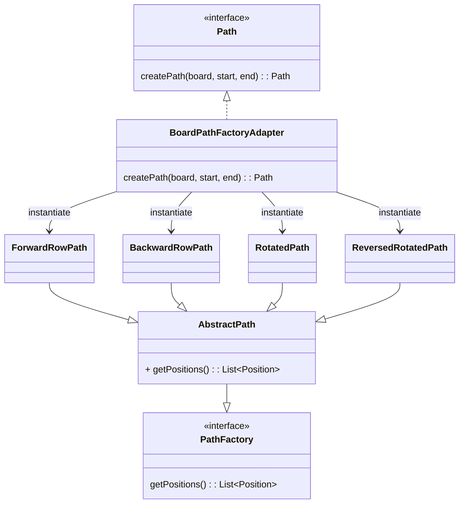

- `Path` acts as the output port used by the application layer.
- `BoardPathFactoryAdapter` determines and creates the correct path implementation.
- `ForwardRowPath` generates forward row traversal paths.
- `BackwardRowPath` generates backward traversal paths.
- `RotatedPath` generates rotated traversal paths.
- `ReversedRotatedPath` generates reversed rotated traversal paths.
- `AbstractPath` provides shared path behaviour and position storage functionality.
- `PathFactory` defines the common abstraction for all path implementations.

### Architectural Concepts

- Ports and Adapters Architecture
- Adapter Pattern
- Factory Pattern
- Strategy-based path generation
- Template Method / Abstract Base Class pattern
- Encapsulation of traversal algorithms

## Board Factory Pattern
This diagram represents the board creation hierarchy used within the game.

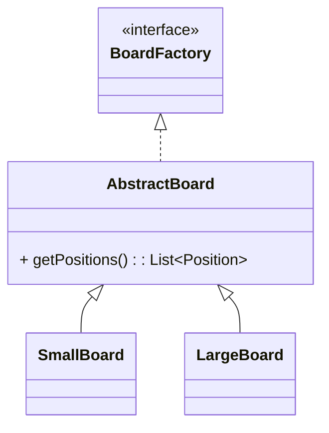

### Structure

- `BoardFactory`
    - Defines the common contract for all board implementations.
    - Acts as the abstraction used throughout the application layer.

- `AbstractBoard`
    - Provides shared board behaviour and reusable logic.
    - Contains common functionality such as:
        - retrieving board positions
        - retrieving column counts

- `SmallBoard` Concrete implementation for smaller game configurations.
- `LargeBoard` Concrete implementation for larger game configurations.

### Architectural Concepts

- Interface-based abstraction
- Template Method / Abstract Base Class pattern
- Shared domain behaviour reuse
- Polymorphic board implementations

## Dice Factory Pattern
This diagram represents the player path hierarchy used to generate movement routes across the board.

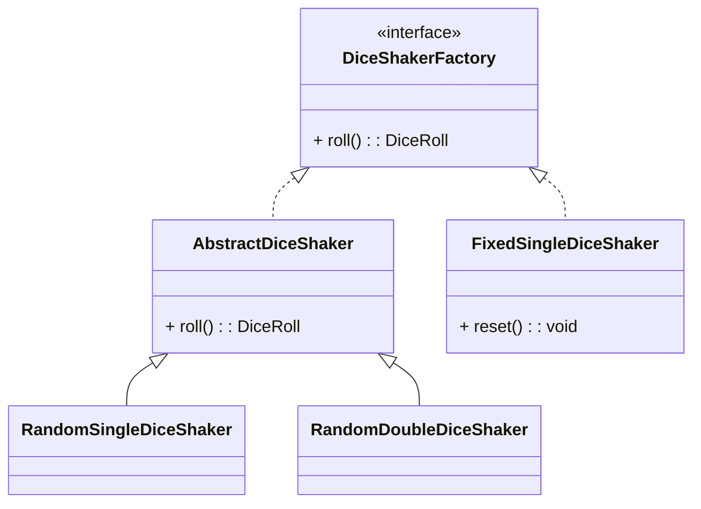

### Structure

- `DiceShakerFactory` Defines the dice rolling contract used by the application.
- `AbstractDiceShaker` Provides shared dice rolling behaviour for random dice implementations.
- `RandomSingleDiceShaker` Simulates rolling a single random dice.
- `RandomDoubleDiceShaker` Simulates rolling two random dice.
- `FixedSingleDiceShaker`
    - Deterministic dice implementation used for testing and replayable game states.
    - Supports resetting the predefined sequence.

### Architectural Concepts

- Strategy pattern
- Template Method / Abstract Base Class pattern
- Testable deterministic implementations
- Runtime-swappable behaviour

## Path Factory Pattern
This diagram represents the player path hierarchy used to generate movement routes across the board.

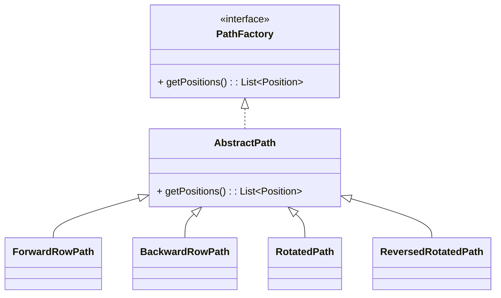

### Structure

- `PathFactory` Defines the common contract for all path implementations.
- `AbstractPath` Provides shared functionality for storing and retrieving path positions.
- `ForwardRowPath` Generates paths moving forward row by row.
- `BackwardRowPath` Generates paths moving backward across rows.
- `RotatedPath` Generates rotated traversal paths across the board.
- `ReversedRotatedPath` Generates reversed rotated traversal paths.

### Architectural Concepts

- Strategy-based path generation
- Polymorphic movement paths
- Shared path behaviour reuse
- Encapsulation of traversal algorithms


## Rule Selection Strategy
This diagram shows how the game chooses which rule variations are active.

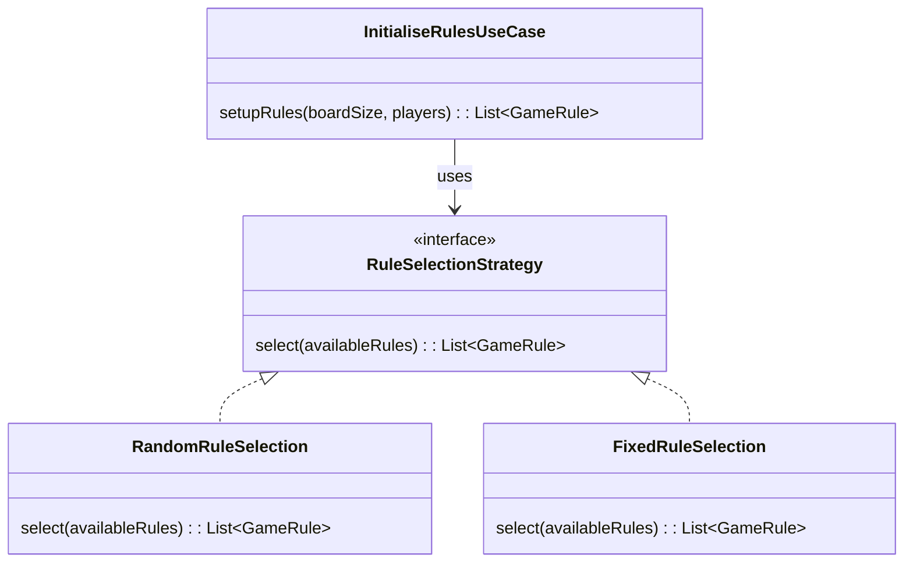

- `RuleSelectionStrategy` defines the rule-selection contract.
- `RandomRuleSelection` is used for random/real gameplay.
- `FixedRuleSelection` is used for predictable testing.
- `InitialiseRulesUseCase` depends on the strategy interface, not a concrete implementation.

### Architectural Concepts

- Strategy Pattern
- Dependency Inversion
- Runtime-swappable behaviour
- Test-friendly configuration

## Teleport Strategy Pattern
This diagram shows how teleport/wormhole positions are generated.

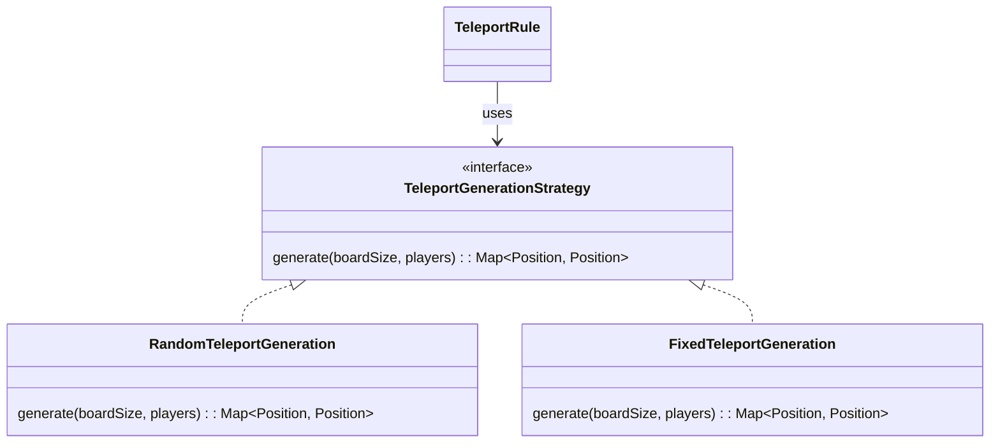

- `TeleportGenerationStrategy` defines how wormholes are created.
- `RandomTeleportGeneration` creates random wormhole positions.
- `FixedTeleportGeneration` creates predictable wormholes for testing.
- `TeleportRule` uses the strategy without knowing whether it is random or fixed.

### Architectural Concepts

- Strategy Pattern
- Open/Closed Principle
- Testable rule behaviour
- Separation between rule logic and generation logic

## Events Strategy Pattern
This diagram shows how important events from a turn are stored and described.

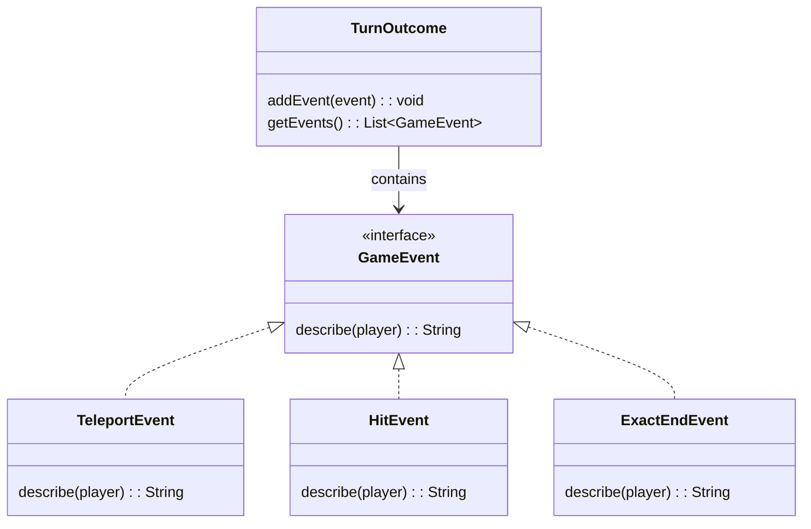


- `GameEvent` defines a common interface for turn events.
- `TeleportEvent` represents a player landing on a wormhole.
- `HitEvent` represents a player hitting another player.
- `ExactEndEvent` represents a player overshooting and bouncing back.
- `TurnOutcome` stores all events that happened during a turn.

### Architectural Concepts

- Domain Event Pattern
- Polymorphism
- Encapsulation of event-specific details
- Cleaner display logic without large switch statements

## Movement Strategy Pattern
This diagram shows how selected rules are converted into movement decorators.

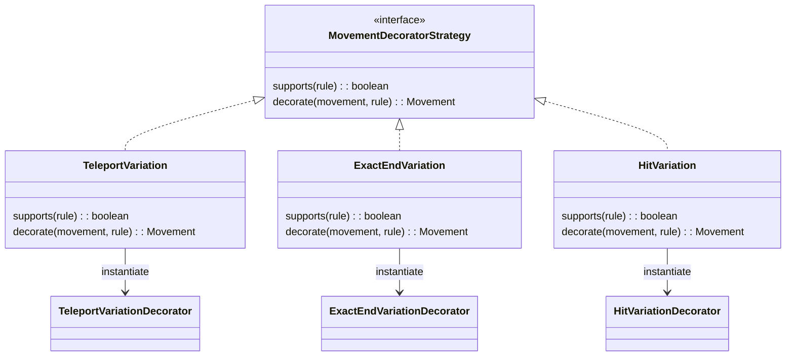

- `MovementDecoratorStrategy` defines how a rule can decorate movement.
- `TeleportVariation` creates a teleport movement decorator.
- `ExactEndVariation` creates an exact-end movement decorator.
- `HitVariation` creates a hit movement decorator.
- Each strategy checks whether it supports a rule, then wraps the movement logic if needed.

### Architectural Concepts

- Strategy Pattern
- Factory-style object creation
- Decorator Pattern support
- Open/Closed Principle

## Movement Decorator Pattern
This diagram represents the movement system and decorator hierarchy used to apply gameplay rule variations dynamically.

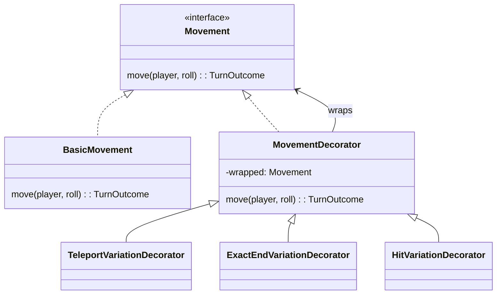

- `Movement` defines the core movement contract used throughout the game.
- `BasicMovement` provides the default player movement behaviour.
- `MovementDecorator` acts as the abstract decorator base class.
    - Wraps another `Movement` implementation.
    - Allows additional behaviour to be layered dynamically.
- `TeleportVariationDecorator` Adds teleport/wormhole movement behaviour.
- `ExactEndVariationDecorator` Adds exact-end win conditions and bounce-back behaviour.
- `HitVariationDecorator` Adds player hit/collision behaviour.

The decorators wrap the base movement implementation at runtime, allowing multiple rule variations to be combined without modifying the core movement logic.

### Architectural Concepts

- Decorator Pattern
- Open/Closed Principle
- Runtime composition of behaviour
- Polymorphism
- Behaviour extension without modifying existing classes
- Separation of core movement logic from rule variations

## Game State Pattern
This diagram represents the game lifecycle state system used to control gameplay flow.


- `GameState` defines the common contract for all game states.
    - Handles state-specific behaviour.
    - Determines whether the game has ended.
    - Controls state transitions.

- `InPlayState`
    - Represents the active gameplay state.
    - Processes turns while the game is still running.
    - Transitions to `GameOverState` once a winner is detected.

- `GameOverState`
    - Represents the completed game state.
    - Stores the winning player.
    - Prevents further gameplay execution once the game has ended.

The game transitions from `InPlayState` to `GameOverState` dynamically at runtime based on gameplay conditions.

### Architectural Concepts

- State Pattern
- Encapsulation of state-specific behaviour
- Runtime state transitions
- Separation of gameplay lifecycle logic
- Polymorphism
- Cleaner control flow without large conditional statements

## Display Observer Pattern
This diagram represents the observer system used to notify display adapters about important gameplay events.

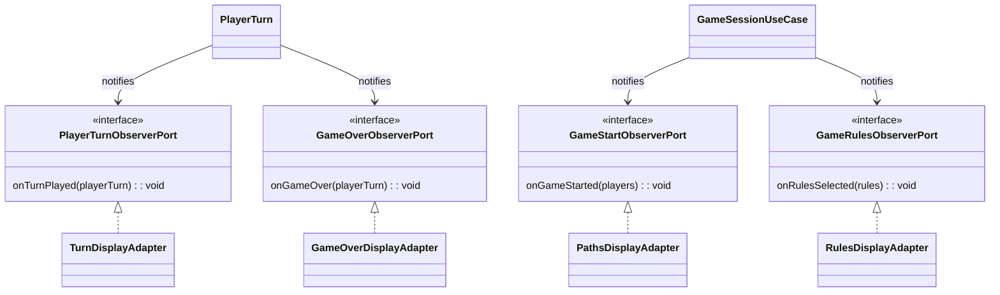

- `PlayerTurnObserverPort` Defines the contract for responding to player turn events.
- `GameOverObserverPort` Defines the contract for responding to game completion events.
- `GameStartObserverPort` Defines the contract for responding to game start events.
- `GameRulesObserverPort` Defines the contract for responding to selected rule events.
- `TurnDisplayAdapter` Displays player turn information.
- `GameOverDisplayAdapter` Displays winner and game-over information.
- `PathsDisplayAdapter` Displays player movement paths when the game starts.
- `RulesDisplayAdapter` Displays the active rules selected for the game.
- `PlayerTurn` Notifies observers whenever a turn is played or the game ends.
- `GameSessionUseCase` Notifies observers when the game starts and when rules are selected.

This architecture allows display behaviour to remain separated from the core gameplay logic.

### Architectural Concepts

- Observer Pattern
- Ports and Adapters Architecture
- Event-driven communication
- Loose coupling
- Separation of Concerns
- Dependency Inversion Principle
- Extensible notification system
