## Application Startup Flow

This diagram represents the entry point and application flow of the game using a Clean Architecture approach.

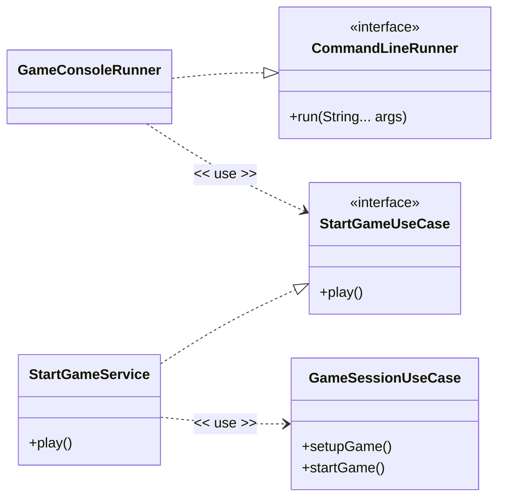

### Components

#### GameConsoleRunner
- Acts as the application's entry point.
- Implements Spring Boot’s `CommandLineRunner`.
- Executes automatically when the application starts.

#### CommandLineRunner
- Spring Boot interface used to run console-based applications.

#### StartGameUseCase
- Input port of the application.
- Defines the behaviour exposed to external layers through:

```text
play()
```

#### StartGameService
- Concrete implementation of `StartGameUseCase`.
- Responsible for orchestrating the game startup process.

#### GameSessionUseCase
- Coordinates the core gameplay lifecycle.
- Handles:
    - `setupGame()`
    - `startGame()`

### Execution Flow

```text
Spring Boot Application
        ↓
GameConsoleRunner.run()
        ↓
StartGameUseCase.play()
        ↓
StartGameService
        ↓
GameSessionUseCase
        ↓
Game setup and gameplay execution
```

### Architectural Concepts Demonstrated

- Clean Architecture
- Dependency Inversion Principle
- Input Port Pattern
- Use Case Orchestration
- Separation of Concerns
- Framework-independent business logic


## Board Hierarchy

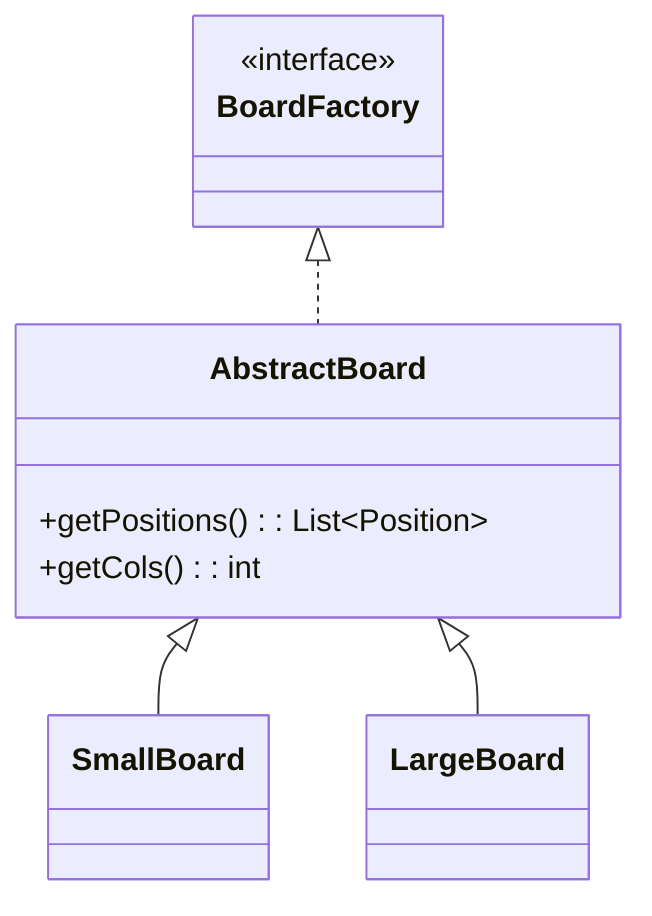

This diagram represents the board creation hierarchy used within the game.

### Structure

- `BoardFactory`
    - Defines the common contract for all board implementations.
    - Acts as the abstraction used throughout the application layer.

- `AbstractBoard`
    - Provides shared board behaviour and reusable logic.
    - Contains common functionality such as:
        - retrieving board positions
        - retrieving column counts

- `SmallBoard`
    - Concrete implementation for smaller game configurations.

- `LargeBoard`
    - Concrete implementation for larger game configurations.

### Architectural Concepts

- Interface-based abstraction
- Template Method / Abstract Base Class pattern
- Shared domain behaviour reuse
- Polymorphic board implementations

---

## Dice Hierarchy

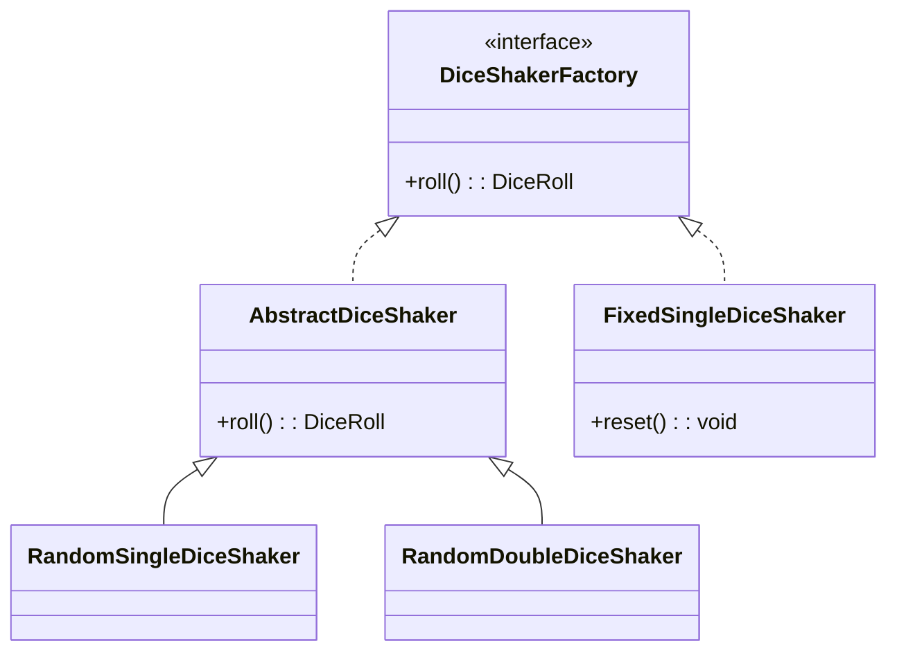

This diagram represents the dice rolling hierarchy used for gameplay and testing.

### Structure

- `DiceShakerFactory`
    - Defines the dice rolling contract used by the application.

- `AbstractDiceShaker`
    - Provides shared dice rolling behaviour for random dice implementations.

- `RandomSingleDiceShaker`
    - Simulates rolling a single random dice.

- `RandomDoubleDiceShaker`
    - Simulates rolling two random dice.

- `FixedSingleDiceShaker`
    - Deterministic dice implementation used for testing and replayable game states.
    - Supports resetting the predefined sequence.

### Architectural Concepts

- Strategy pattern
- Template Method / Abstract Base Class pattern
- Testable deterministic implementations
- Runtime-swappable behaviour

---

## Path Hierarchy

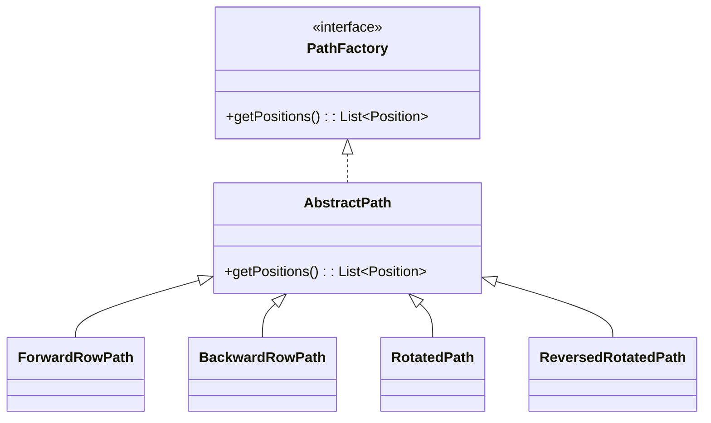

This diagram represents the player path hierarchy used to generate movement routes across the board.

### Structure

- `PathFactory`
    - Defines the common contract for all path implementations.

- `AbstractPath`
    - Provides shared functionality for storing and retrieving path positions.

- `ForwardRowPath`
    - Generates paths moving forward row by row.

- `BackwardRowPath`
    - Generates paths moving backward across rows.

- `RotatedPath`
    - Generates rotated traversal paths across the board.

- `ReversedRotatedPath`
    - Generates reversed rotated traversal paths.

### Architectural Concepts

- Strategy-based path generation
- Polymorphic movement paths
- Shared path behaviour reuse
- Encapsulation of traversal algorithms


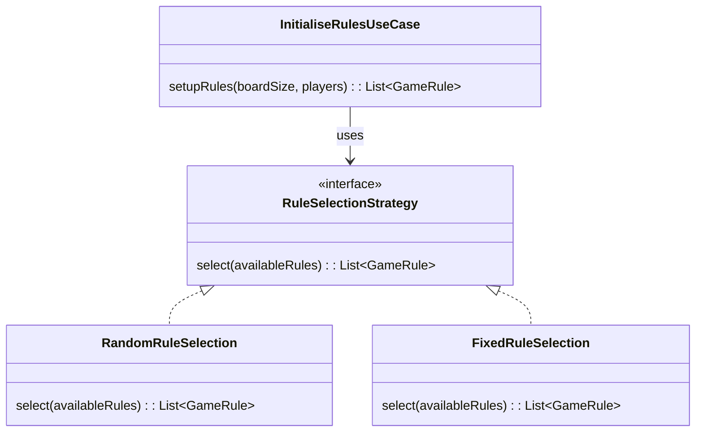

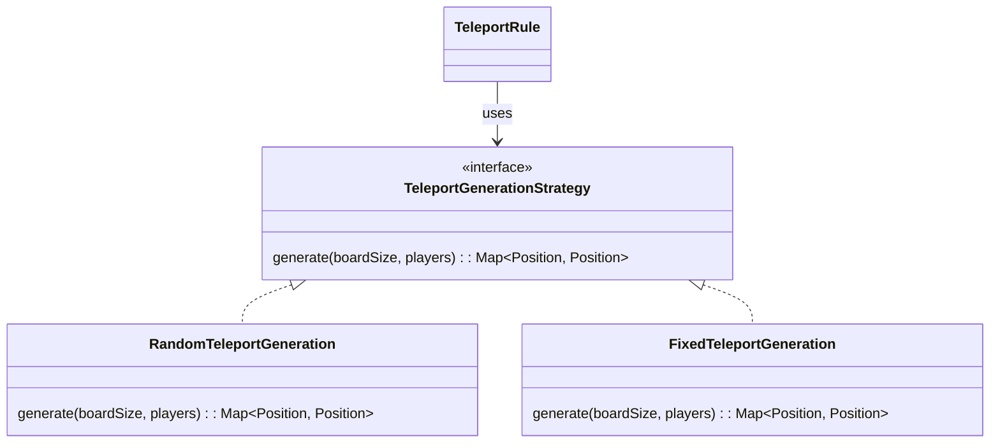

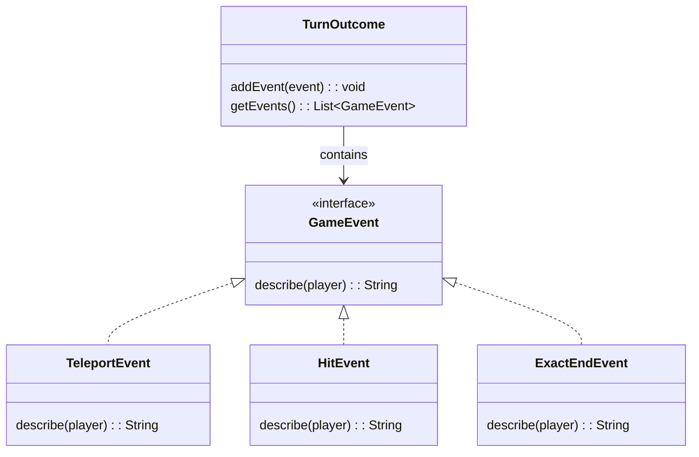

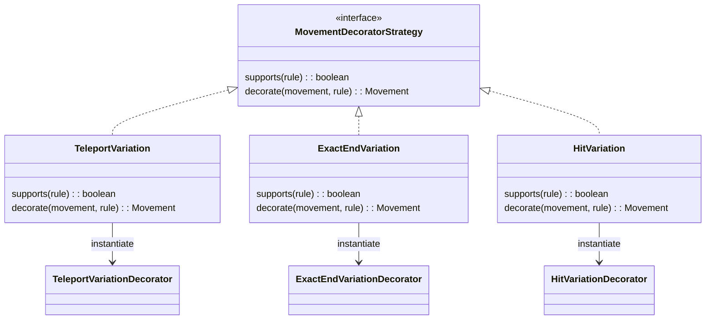

Strategy Stuff

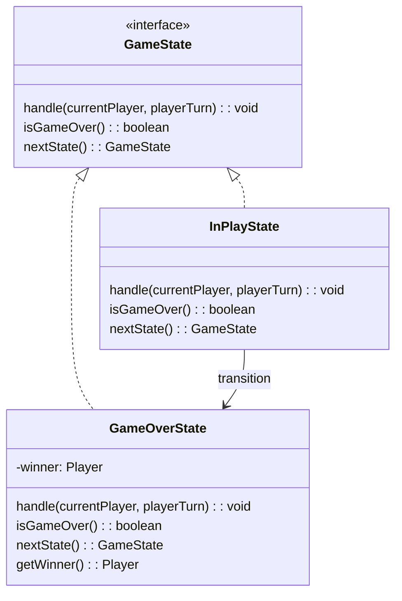

State stuff


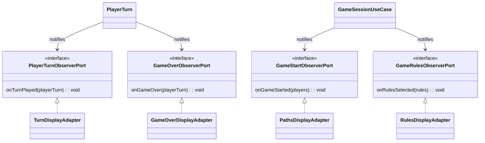

Observer Stuff

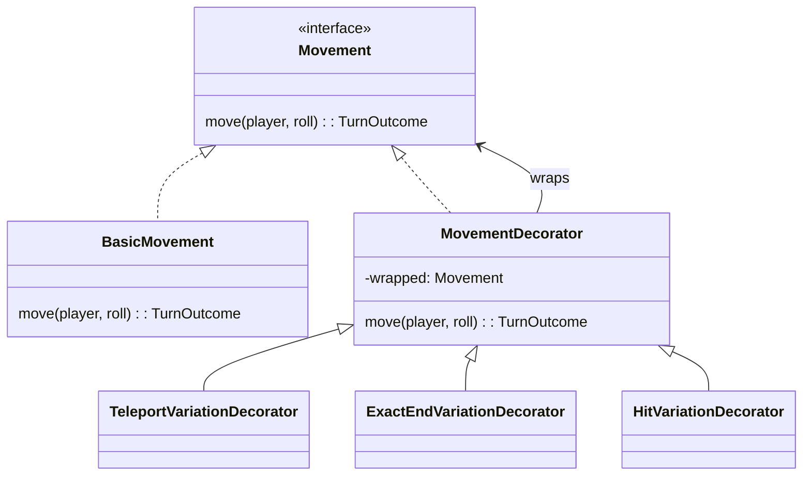

```mermaid
classDiagram
direction LR

    namespace Adapter {
        Board <|.. BoardFactoryAdapter
        BoardFactoryAdapter --> SmallBoard : instantiate
        BoardFactoryAdapter --> LargeBoard : instantiate
        SmallBoard --|> BoardFactory
        LargeBoard --|> BoardFactory

        class Board {
            <<interface>>
            createBoard(playerCount): BoardFactory
        }

        class BoardFactoryAdapter {
            createBoard(playerCount): BoardFactory
        }

        class BoardFactory {
            <<interface>>
        }

        class SmallBoard
        class LargeBoard
    }

    namespace TemplateMethod {
        BoardFactory <|.. AbstractBoard
        AbstractBoard <|-- SmallBoard
        AbstractBoard <|-- LargeBoard

        class AbstractBoard {
            #buildBoard(): List~Position~
            +getPositions(): List~Position~
            +getCols(): int
        }
    }
```