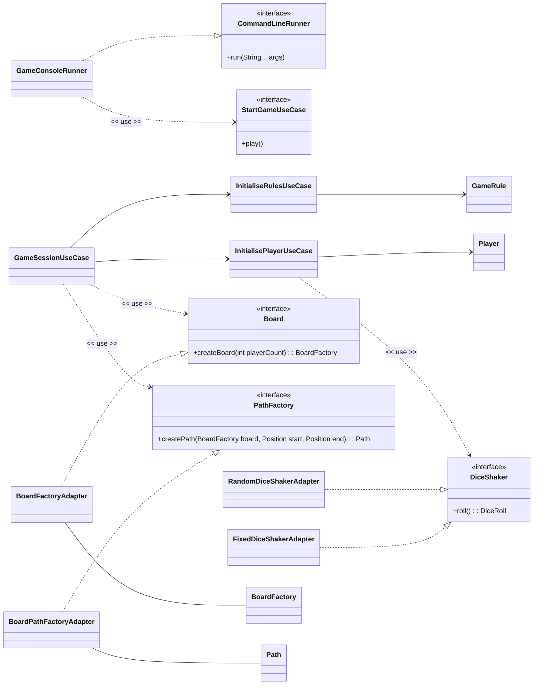

```mermaid
classDiagram
    direction LR

    %% =========================
    %% DRIVING
    %% =========================

    class GameConsoleRunner {
    }

    class CommandLineRunner {
        <<interface>>
        +run(String... args)
    }

    class StartGameUseCase {
        <<interface>>
        +play()
    }

    %% =========================
    %% APPLICATION
    %% =========================

    class GameSessionUseCase {
    }

    class InitialisePlayerUseCase {
    }

    class InitialiseRulesUseCase {
    }

    %% =========================
    %% REQUIRED PORTS
    %% =========================

    class DiceShaker {
        <<interface>>
        +roll() : DiceRoll
    }

    class Board {
        <<interface>>
        +createBoard(int playerCount) : BoardFactory
    }

    class PathFactory {
        <<interface>>
        +createPath(BoardFactory board, Position start, Position end) : Path
    }

    %% =========================
    %% DRIVEN ADAPTERS
    %% =========================

    class RandomDiceShakerAdapter {
    }

    class FixedDiceShakerAdapter {
    }

    class BoardFactoryAdapter {
    }

    class BoardPathFactoryAdapter {
    }

    %% =========================
    %% DOMAIN
    %% =========================

    class BoardFactory {
    }

    class Path {
    }

    class Player {
    }

    class GameRule {
    }

    %% =========================
    %% RELATIONSHIPS
    %% =========================

    GameConsoleRunner ..|> CommandLineRunner
    GameConsoleRunner ..> StartGameUseCase : << use >>

    GameSessionUseCase ..> Board : << use >>
    GameSessionUseCase ..> PathFactory : << use >>

    InitialisePlayerUseCase ..> DiceShaker : << use >>

    RandomDiceShakerAdapter ..|> DiceShaker
    FixedDiceShakerAdapter ..|> DiceShaker

    BoardFactoryAdapter ..|> Board
    BoardPathFactoryAdapter ..|> PathFactory

    BoardFactoryAdapter -- BoardFactory
    BoardPathFactoryAdapter -- Path

    GameSessionUseCase --> InitialisePlayerUseCase
    GameSessionUseCase --> InitialiseRulesUseCase

    InitialisePlayerUseCase --> Player
    InitialiseRulesUseCase --> GameRule
```