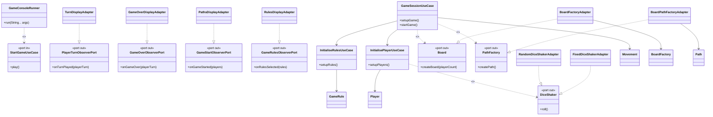

```mermaid
classDiagram

%% =========================
%% DRIVING ADAPTERS
%% =========================

class GameConsoleRunner {
    +run(String... args)
}

class StartGameUseCase {
    <<port in>>
    +play()
}

class TurnDisplayAdapter
class GameOverDisplayAdapter
class PathsDisplayAdapter
class RulesDisplayAdapter

class PlayerTurnObserverPort {
    <<port out>>
    +onTurnPlayed(playerTurn)
}

class GameOverObserverPort {
    <<port out>>
    +onGameOver(playerTurn)
}

class GameStartObserverPort {
    <<port out>>
    +onGameStarted(players)
}

class GameRulesObserverPort {
    <<port out>>
    +onRulesSelected(rules)
}

GameConsoleRunner ..> StartGameUseCase : <<use>>

TurnDisplayAdapter ..|> PlayerTurnObserverPort
GameOverDisplayAdapter ..|> GameOverObserverPort
PathsDisplayAdapter ..|> GameStartObserverPort
RulesDisplayAdapter ..|> GameRulesObserverPort

%% =========================
%% USE CASES
%% =========================

class GameSessionUseCase {
    +setupGame()
    +startGame()
}

class InitialisePlayerUseCase {
    +setupPlayers()
}

class InitialiseRulesUseCase {
    +setupRules()
}

GameSessionUseCase --> InitialisePlayerUseCase
GameSessionUseCase --> InitialiseRulesUseCase

%% =========================
%% REQUIRED PORTS
%% =========================

class DiceShaker {
    <<port out>>
    +roll()
}

class Board {
    <<port out>>
    +createBoard(playerCount)
}

class PathFactory {
    <<port out>>
    +createPath()
}

GameSessionUseCase ..> Board : <<use>>
GameSessionUseCase ..> PathFactory : <<use>>

InitialisePlayerUseCase ..> DiceShaker : <<use>>

%% =========================
%% DRIVEN ADAPTERS
%% =========================

class RandomDiceShakerAdapter
class FixedDiceShakerAdapter

class BoardFactoryAdapter

class BoardPathFactoryAdapter

RandomDiceShakerAdapter ..|> DiceShaker
FixedDiceShakerAdapter ..|> DiceShaker

BoardFactoryAdapter ..|> Board

BoardPathFactoryAdapter ..|> PathFactory

%% =========================
%% DOMAIN
%% =========================

class Player
class Movement
class GameRule
class BoardFactory
class Path

InitialisePlayerUseCase --> Player
GameSessionUseCase --> Movement
InitialiseRulesUseCase --> GameRule

BoardFactoryAdapter --> BoardFactory
BoardPathFactoryAdapter --> Path
```