# Game

## Introduction

HyperJump is a Java-based turn-based board game that allows players to move across a board using dice rolls. The game supports multiple gameplay variations such as single-die movement, exact-end rules, hit detection, teleporting through wormholes, and larger boards for four players.

The project is designed using clean architecture principles, especially **Ports and Adapters Architecture**, so that the core game logic is separated from infrastructure code such as console output, persistence, replay storage, and dice adapters.

The implementation also uses several design patterns, including:

- Factory Pattern
- Strategy Pattern
- Decorator Pattern
- State Pattern
- Observer Pattern
- Repository Pattern

These patterns help make the game easier to extend, test, and maintain.

# Architecture

## Game

The `GameConsoleRunner` receives user interaction from the console and calls the input ports frome `StartGameUseCase`
This interfaces used by external adapters to interact with the application core.

UML Diagram

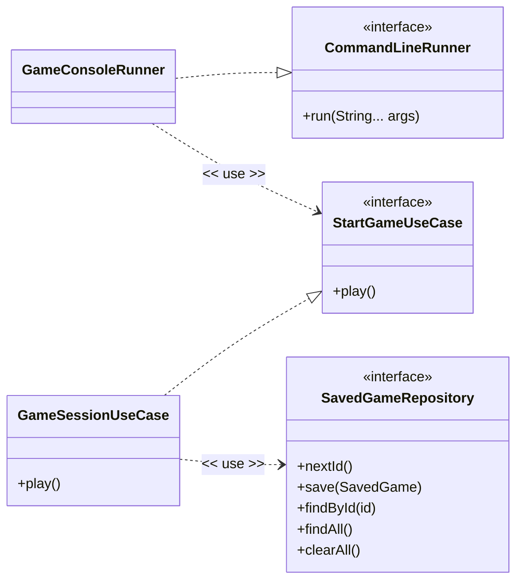
```mermaid
classDiagram
    direction LR

    class GameConsoleRunner {
    }

    class CommandLineRunner {
        <<interface>>
        +run(String... args)
    }

    class StartGameUseCase {
        <<interface>>
        +play()
    }

    class GameSessionUseCase {
        +play()
    }

    class SavedGameRepository {
        <<interface>>
        +nextId()
        +save(SavedGame)
        +findById(id)
        +findAll()
        +clearAll()
    }

    GameConsoleRunner ..|> CommandLineRunner
    GameConsoleRunner ..> StartGameUseCase : << use >>

    GameSessionUseCase ..|> StartGameUseCase
    GameSessionUseCase ..> SavedGameRepository : << use >>
```

Application services implement the input ports and coordinate the game flow.

Files:
- `StartGameService`
- `GameSessionUseCase`
- `InitialisePlayerUseCase`
- `InitialiseRulesUseCase`

These classes control the use cases but do not directly depend on infrastructure details.

## Replay

The `GameConsoleRunner` receives user replay interaction from the console and calls the input ports from `ReplayGameUseCase`.
This interfaces used by external adapters to interact with the application core.

UML Diagram

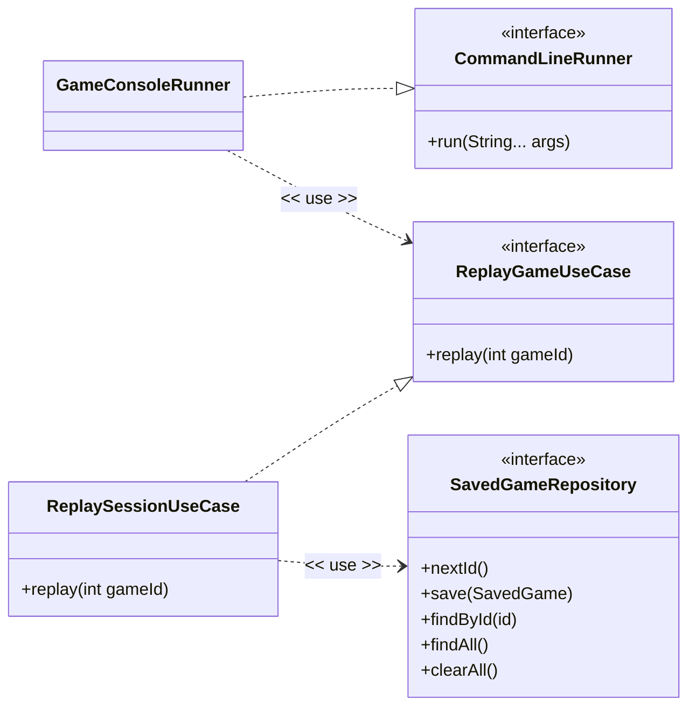
```mermaid
classDiagram
    direction LR

    class GameConsoleRunner {
    }

    class CommandLineRunner {
        <<interface>>
        +run(String... args)
    }

    class ReplayGameUseCase {
        <<interface>>
        +replay(int gameId)
    }

    class ReplaySessionUseCase {
        +replay(int gameId)
    }

    class SavedGameRepository {
        <<interface>>
        +nextId()
        +save(SavedGame)
        +findById(id)
        +findAll()
        +clearAll()
    }

    GameConsoleRunner ..|> CommandLineRunner
    GameConsoleRunner ..> ReplayGameUseCase : << use >>

    ReplaySessionUseCase ..|> ReplayGameUseCase
    ReplaySessionUseCase ..> SavedGameRepository : << use >>
```

Application services implement the input ports and coordinate the game flow.

Files:
- `ReplayGameService`
- `ReplaySessionUseCase`
- `InitialisePlayerUseCase`
- `InitialiseRulesUseCase`
- `InitialiseReplayUseCase`

These classes control the use cases but do not directly depend on infrastructure details.

# Ports and Adapters 

The project uses **Ports and Adapters**, also known as **Hexagonal Architecture**.

The main idea is that the core application should not depend directly on external systems. Instead, the application depends on interfaces called **ports**, and infrastructure classes implement those ports as **adapters**.

## Board Port

Output ports define what the application needs from outside systems.

UML Diagram

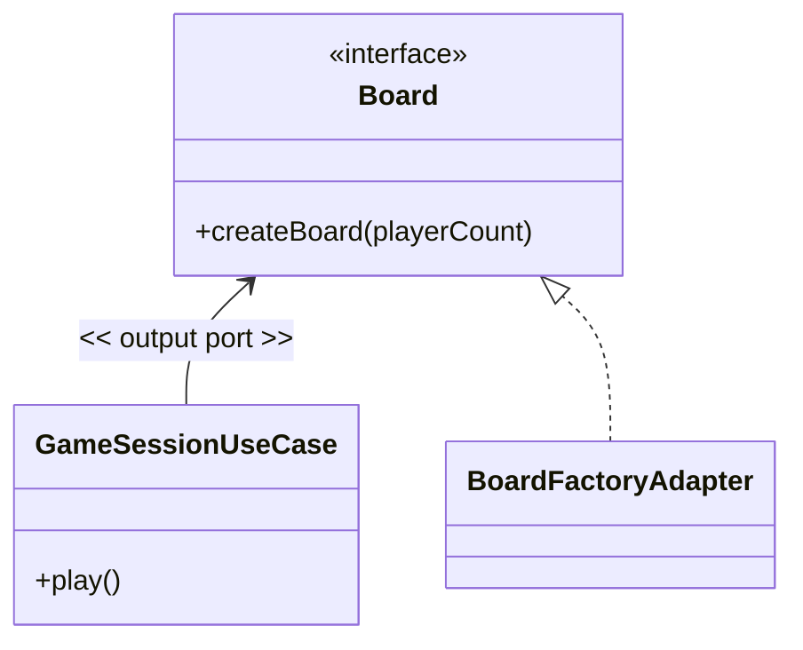
```mermaid
classDiagram
    direction BT

    class GameSessionUseCase {
        +play()
    }

    class Board {
        <<interface>>
        +createBoard(playerCount)
    }

    class BoardFactoryAdapter {
    }

    GameSessionUseCase --> Board : << output port >>
    BoardFactoryAdapter ..|> Board
```

- `Board`
This port requires to notify the game has created a board and interacts with the associated adapter.

## DiceShaker Port

Output ports define what the application needs from outside systems.

UML Diagram

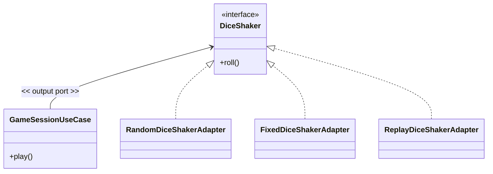
```mermaid
classDiagram
    direction BT

    class GameSessionUseCase {
        +play()
    }

    class DiceShaker {
        <<interface>>
        +roll()
    }

    class RandomDiceShakerAdapter {
    }

    class FixedDiceShakerAdapter {
    }

    class ReplayDiceShakerAdapter {
    }

    GameSessionUseCase --> DiceShaker : << output port >>
    RandomDiceShakerAdapter ..|> DiceShaker
    FixedDiceShakerAdapter ..|> DiceShaker
    ReplayDiceShakerAdapter ..|> DiceShaker
```

- `DiceShaker`
This port requires to notify types of diceshaker sequences and interacts with the associated adapter.

## Game Saved Port

Output ports define what the application needs from outside systems.

UML Diagram

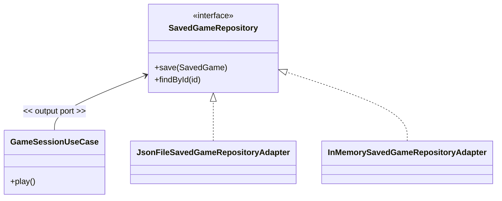
```mermaid
classDiagram
    direction BT

    class GameSessionUseCase {
        +play()
    }

    class SavedGameRepository {
        <<interface>>
        +save(SavedGame)
        +findById(id)
    }

    class JsonFileSavedGameRepositoryAdapter {
    }

    class InMemorySavedGameRepositoryAdapter {
    }

    GameSessionUseCase --> SavedGameRepository : << output port >>

    JsonFileSavedGameRepositoryAdapter ..|> SavedGameRepository
    InMemorySavedGameRepositoryAdapter ..|> SavedGameRepository
```

- `SavedGameRepository`
This port requires to notify game repository has saved and interacts with the associated adapter.
These adapters connect the application to external concerns

## Dependency 

The dependencies point inward toward the application core.

```text
Console / Infrastructure
        ↓
Adapters
        ↓
Ports / Interfaces
        ↓
Application Use Cases
        ↓
Domain Model
```

This means the core game logic does not depend on console output, files, JSON storage, or infrastructure classes.

## SOLID 

### Dependency Inversion 

The application depends on port interfaces such as `Board`, `DiceShaker`, and `SavedGameRepository`.

### Single Responsibility 

Each adapter has one job. For example, `JsonFileSavedGameRepositoryAdapter` handles file persistence although the adapter isnt fully implemented as of yet the class is there for further developement, while the console adpaters handles console output for example `ConsoleTurnAdapter` handles turn output for each player.

### Open/Closed 

New adapters can be added without changing the core game logic.

# Variations / Advanced Features

## Single Die Variation

The game supports the use of a single six-sided die for testing purpose the fixed single dice sequence will be used as an alternative to the standard random two-dice setup.
The dice system is abstracted through dice interfaces and implementations. This allows the game to use either a random double dice / single dice, or for this example a fixed single dice for replay and testing.


### UML Diagram

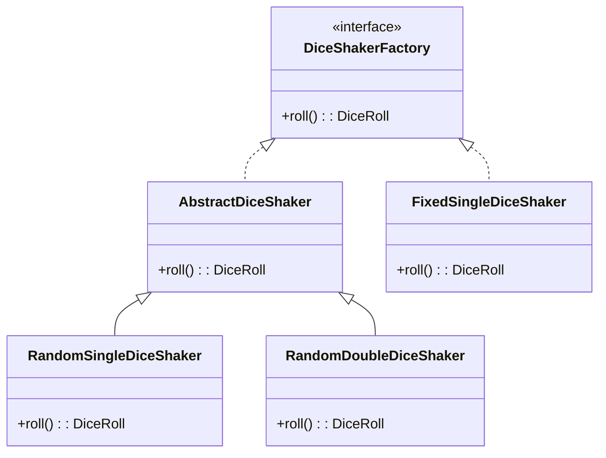
```mermaid
classDiagram
    DiceShakerFactory <|.. AbstractDiceShaker
    DiceShakerFactory <|.. FixedSingleDiceShaker
    AbstractDiceShaker <|-- RandomSingleDiceShaker
    AbstractDiceShaker <|-- RandomDoubleDiceShaker

    class DiceShakerFactory {
        <<interface>>
        +roll(): DiceRoll
    }

    class AbstractDiceShaker {
        +roll(): DiceRoll
    }

    class RandomSingleDiceShaker {
        +roll(): DiceRoll
    }

    class RandomDoubleDiceShaker {
        +roll(): DiceRoll
    }

    class FixedSingleDiceShaker {
        +roll(): DiceRoll
    }
```

### SOLID Principles 

#### Single Responsibility 

Each dice class is only responsible for producing dice rolls.

#### Open/Closed 

New dice types can be added without changing the main game session logic.

#### Dependency Inversion 

The game depends on dice abstractions rather than concrete dice classes.

## Exact End Variation

The Exact End variation is implemented using a movement decorator. The `ExactEndVariationDecorator` wraps the normal movement behaviour and adds bounce-back logic.

### UML Diagram

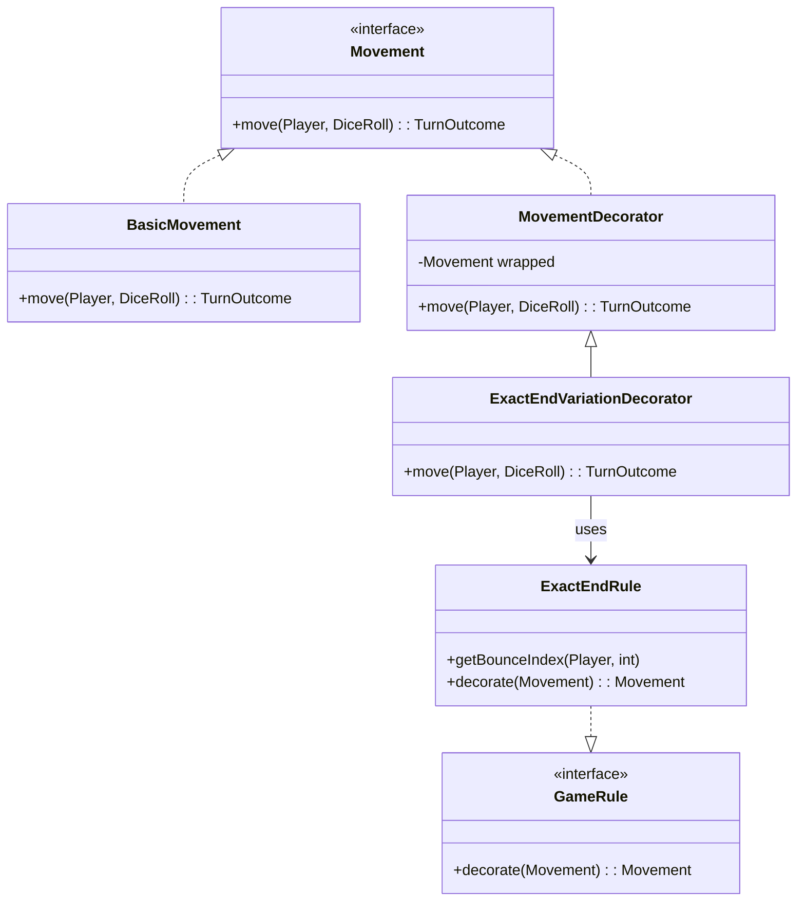
```mermaid
classDiagram
    Movement <|.. BasicMovement
    Movement <|.. MovementDecorator
    MovementDecorator <|-- ExactEndVariationDecorator

    ExactEndVariationDecorator --> ExactEndRule : uses
    ExactEndRule ..|> GameRule

    class Movement {
        <<interface>>
        +move(Player, DiceRoll): TurnOutcome
    }

    class BasicMovement {
        +move(Player, DiceRoll): TurnOutcome
    }

    class MovementDecorator {
        -Movement wrapped
        +move(Player, DiceRoll): TurnOutcome
    }

    class ExactEndVariationDecorator {
        +move(Player, DiceRoll): TurnOutcome
    }

    class ExactEndRule {
        +getBounceIndex(Player, int)
        +decorate(Movement): Movement
    }

    class GameRule {
        <<interface>>
        +decorate(Movement): Movement
    }
```

### SOLID Principles

#### Open/Closed 

Exact-end behaviour is added without modifying `BasicMovement`.

#### Single Responsibility 

`ExactEndVariationDecorator` only handles exact-end movement behaviour.

#### Liskov Substitution 

The decorator can be used wherever a `Movement` object is expected.

## Hit Variation

The Hit variation uses both the **Decorator Pattern** and the **Strategy Pattern**. The decorator adds hit behaviour to movement, while `HitStrategy` allows the hit detection algorithm to be separated from the rule itself.

### UML Diagram

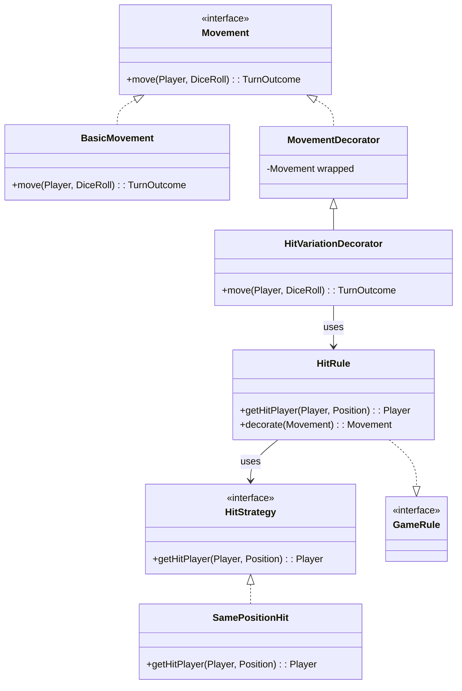
```mermaid
classDiagram
    Movement <|.. BasicMovement
    Movement <|.. MovementDecorator
    MovementDecorator <|-- HitVariationDecorator

    HitVariationDecorator --> HitRule : uses
    HitRule --> HitStrategy : uses
    HitStrategy <|.. SamePositionHit
    HitRule ..|> GameRule

    class Movement {
        <<interface>>
        +move(Player, DiceRoll): TurnOutcome
    }

    class BasicMovement {
        +move(Player, DiceRoll): TurnOutcome
    }

    class MovementDecorator {
        -Movement wrapped
    }

    class HitVariationDecorator {
        +move(Player, DiceRoll): TurnOutcome
    }

    class HitRule {
        +getHitPlayer(Player, Position): Player
        +decorate(Movement): Movement
    }

    class HitStrategy {
        <<interface>>
        +getHitPlayer(Player, Position): Player
    }

    class SamePositionHit {
        +getHitPlayer(Player, Position): Player
    }

    class GameRule {
        <<interface>>
    }
```

### SOLID Principles

#### Single Responsibility Principle

`HitVariationDecorator` handles movement behaviour, while `SamePositionHit` handles hit detection logic.

#### Open/Closed Principle

New hit strategies can be added without changing `HitRule`.

#### Dependency Inversion Principle

`HitRule` depends on the `HitStrategy` interface rather than a concrete implementation.

## Teleport Variation

The Teleport variation uses the **Decorator Pattern** to add teleport behaviour to movement. It also uses the **Strategy Pattern** to allow different ways of generating wormholes, such as fixed teleport positions, random teleport positions, or no teleport positions.

### UML Diagram

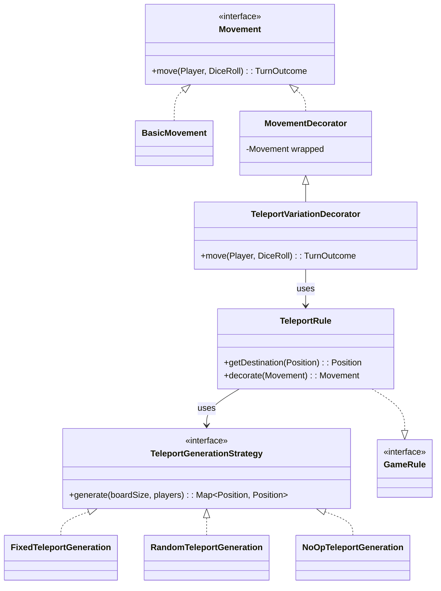
```mermaid
classDiagram
    Movement <|.. BasicMovement
    Movement <|.. MovementDecorator
    MovementDecorator <|-- TeleportVariationDecorator

    TeleportVariationDecorator --> TeleportRule : uses
    TeleportRule --> TeleportGenerationStrategy : uses

    TeleportGenerationStrategy <|.. FixedTeleportGeneration
    TeleportGenerationStrategy <|.. RandomTeleportGeneration
    TeleportGenerationStrategy <|.. NoOpTeleportGeneration

    TeleportRule ..|> GameRule

    class Movement {
        <<interface>>
        +move(Player, DiceRoll): TurnOutcome
    }

    class BasicMovement

    class MovementDecorator {
        -Movement wrapped
    }

    class TeleportVariationDecorator {
        +move(Player, DiceRoll): TurnOutcome
    }

    class TeleportRule {
        +getDestination(Position): Position
        +decorate(Movement): Movement
    }

    class TeleportGenerationStrategy {
        <<interface>>
        +generate(boardSize, players): Map~Position, Position~
    }

    class FixedTeleportGeneration

    class RandomTeleportGeneration

    class NoOpTeleportGeneration

    class GameRule {
        <<interface>>
    }
```

### SOLID Principles

#### Open/Closed 

Teleport behaviour and teleport generation can be changed without modifying the main movement logic.

#### Single Responsibility 

`TeleportVariationDecorator` handles teleport movement, while teleport generation classes handle wormhole creation.

#### Dependency Inversion Principle

`TeleportRule` depends on `TeleportGenerationStrategy`, not a concrete generator.

## Large Board Variation

The game uses a board factory adapter to create the correct board based on the number of players. This separates board creation from the main game logic.
The game supports two board/player configurations:

- Small 5x5 board with 2 players
- Large 6x6 board with 4 players

### UML Diagram

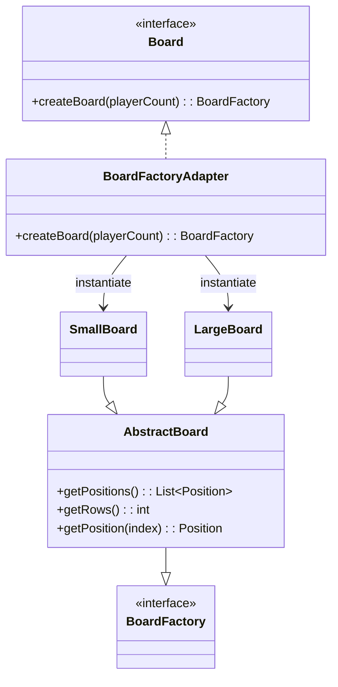
```mermaid
classDiagram
    Board <|.. BoardFactoryAdapter
    BoardFactoryAdapter --> SmallBoard : instantiate
    BoardFactoryAdapter --> LargeBoard : instantiate

    SmallBoard --|> AbstractBoard
    LargeBoard --|> AbstractBoard

    AbstractBoard --|> BoardFactory

    class Board {
        <<interface>>
        +createBoard(playerCount): BoardFactory
    }

    class BoardFactoryAdapter {
        +createBoard(playerCount): BoardFactory
    }

    class BoardFactory {
        <<interface>>
    }

    class AbstractBoard {
        +getPositions(): List~Position~
        +getRows(): int
        +getPosition(index): Position
    }

    class SmallBoard

    class LargeBoard
```

### SOLID Principles

#### Open/Closed 

New board types can be added without changing the main game flow.

#### Liskov Substitution 

`SmallBoard` and `LargeBoard` can both be used as `BoardFactory` implementations.

#### Dependency Inversion 

The application uses the `Board` port instead of directly depending on board implementations.

# Advanced Features

## Game State Machine

The game state machine is implemented using the **State Pattern**. Each state controls its own behaviour rather than using large conditional statements.

- Ready State
- In Play State
- Game Over State

### State UML Diagram

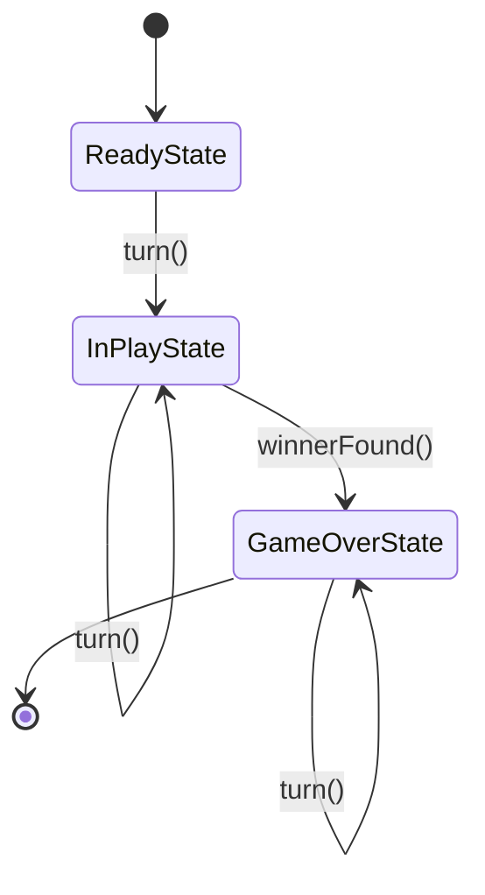
```mermaid
stateDiagram-v2
    [*] --> ReadyState

    ReadyState --> InPlayState : turn()
    InPlayState --> InPlayState : turn()
    InPlayState --> GameOverState : winnerFound()

    GameOverState --> GameOverState : turn()
    GameOverState --> [*]
```

### Class UML Diagram

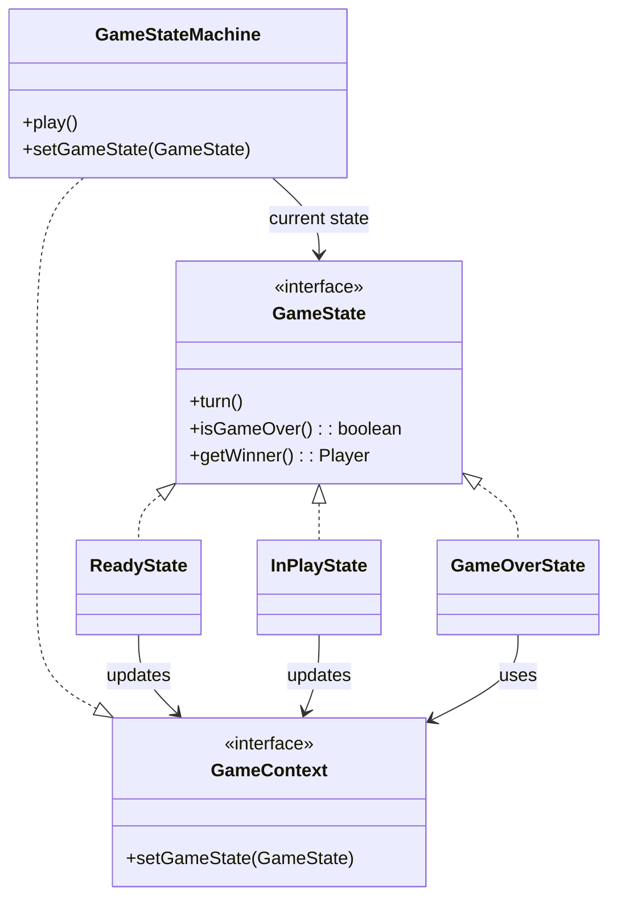
```mermaid
classDiagram
    GameState <|.. ReadyState
    GameState <|.. InPlayState
    GameState <|.. GameOverState

    GameStateMachine --> GameState : current state
    GameStateMachine ..|> GameContext

    ReadyState --> GameContext : updates
    InPlayState --> GameContext : updates
    GameOverState --> GameContext : uses

    class GameState {
        <<interface>>
        +turn()
        +isGameOver(): boolean
        +getWinner(): Player
    }

    class GameContext {
        <<interface>>
        +setGameState(GameState)
    }

    class GameStateMachine {
        +play()
        +setGameState(GameState)
    }

    class ReadyState

    class InPlayState

    class GameOverState
```

### SOLID Principles 

#### Single Responsibility 

Each state class only handles behaviour for one game state.

#### Open/Closed 

New states can be added without rewriting the state machine.

#### Liskov Substitution 

All states implement `GameState` and can be used interchangeably.

## Game Save and Replay

The save and replay system uses ports and adapters to keep persistence and replay dice separate from the core game logic.
The game can save completed games in memory and replay them later using the saved configuration and dice rolls.

### UML Diagram

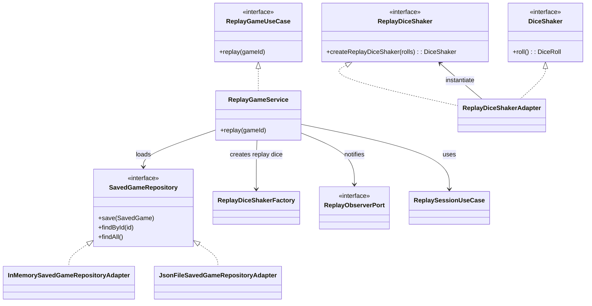
```mermaid
classDiagram
    ReplayGameUseCase <|.. ReplayGameService

    ReplayGameService --> SavedGameRepository : loads
    ReplayGameService --> ReplayDiceShakerFactory : creates replay dice
    ReplayGameService --> ReplayObserverPort : notifies
    ReplayGameService --> ReplaySessionUseCase : uses

    SavedGameRepository <|.. InMemorySavedGameRepositoryAdapter
    SavedGameRepository <|.. JsonFileSavedGameRepositoryAdapter

    ReplayDiceShaker <|.. ReplayDiceShakerAdapter
    DiceShaker <|.. ReplayDiceShakerAdapter

    ReplayDiceShakerAdapter --> ReplayDiceShaker : instantiate

    class ReplayGameUseCase {
        <<interface>>
        +replay(gameId)
    }

    class ReplayGameService {
        +replay(gameId)
    }

    class SavedGameRepository {
        <<interface>>
        +save(SavedGame)
        +findById(id)
        +findAll()
    }

    class ReplayDiceShaker {
        <<interface>>
        +createReplayDiceShaker(rolls): DiceShaker
    }

    class DiceShaker {
        <<interface>>
        +roll(): DiceRoll
    }

    class ReplayObserverPort {
        <<interface>>
    }

    class ReplaySessionUseCase

    class InMemorySavedGameRepositoryAdapter

    class JsonFileSavedGameRepositoryAdapter

    class ReplayDiceShakerAdapter

    class ReplayDiceShakerAdapter
```

### SOLID Principles 

#### Single Responsibility 

`ReplayGameService` handles replay, repositories handle saving/loading, and replay dice adapters reproduce saved dice rolls.

#### Dependency Inversion 

Replay logic depends on `SavedGameRepository` and `ReplayDiceShaker` interfaces.

#### Open/Closed 

Different storage implementations can be added without changing replay logic.

# Design Patterns 

## Factory Pattern

Pattern is used in:

- `BoardFactory`
- `BoardFactoryAdapter`
- `SmallBoard`
- `LargeBoard`
- `DiceShakerFactory`
- `ReplayDiceShakerFactory`

### UML Diagram

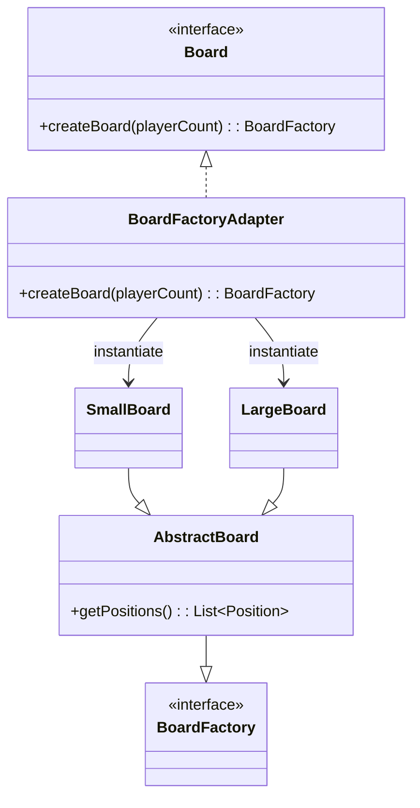
```mermaid
classDiagram
    Board <|.. BoardFactoryAdapter
    BoardFactoryAdapter --> SmallBoard : instantiate
    BoardFactoryAdapter --> LargeBoard : instantiate

    SmallBoard --|> AbstractBoard
    LargeBoard --|> AbstractBoard

    AbstractBoard --|> BoardFactory

    class Board {
        <<interface>>
        +createBoard(playerCount): BoardFactory
    }

    class BoardFactoryAdapter {
        +createBoard(playerCount): BoardFactory
    }

    class BoardFactory {
        <<interface>>
    }

    class AbstractBoard {
        +getPositions(): List~Position~
    }

    class SmallBoard

    class LargeBoard
```

### Why It Is Used

The Factory Pattern is used to separate object creation from game logic. For example, `BoardFactoryAdapter` decides whether to create a `SmallBoard` or a `LargeBoard`.

### SOLID Principles 

#### Open/Closed 

New board types can be added without changing the game session logic.

#### Single Responsibility 

The factory is responsible only for object creation.

#### Dependency Inversion 

The game uses the `Board` abstraction instead of creating concrete board objects directly.

## Strategy Pattern

Pattern is used in:

- `RuleSelectionStrategy`
- `FixedRuleSelection`
- `RandomRuleSelection`
- `SavedRuleSelection`
- `InitialiseRulesUseCase`

### UML Diagram

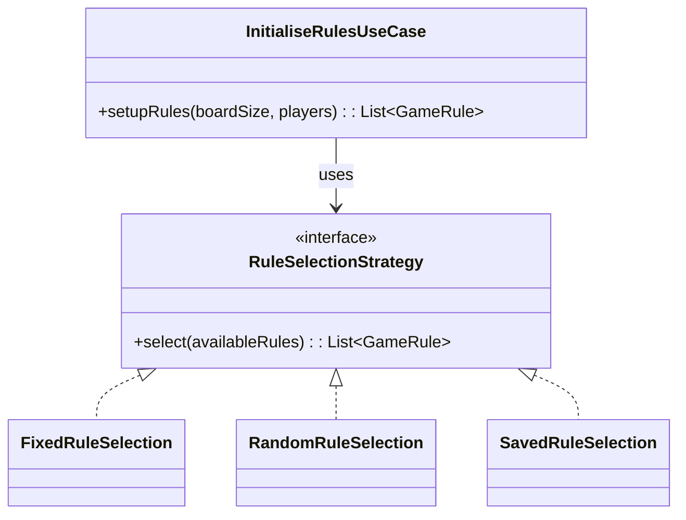
```mermaid
classDiagram
    RuleSelectionStrategy <|.. FixedRuleSelection
    RuleSelectionStrategy <|.. RandomRuleSelection
    RuleSelectionStrategy <|.. SavedRuleSelection

    InitialiseRulesUseCase --> RuleSelectionStrategy : uses

    class InitialiseRulesUseCase {
        +setupRules(boardSize, players): List~GameRule~
    }

    class RuleSelectionStrategy {
        <<interface>>
        +select(availableRules): List~GameRule~
    }

    class FixedRuleSelection

    class RandomRuleSelection

    class SavedRuleSelection
```

### Why It Is Used

Rule selection can change depending on whether the game uses fixed rules, random rules, or saved rules for replay. The Strategy Pattern allows this behaviour to change without modifying `InitialiseRulesUseCase`.

### SOLID Principles 

#### Open/Closed 

New rule-selection strategies can be added without changing the rule setup use case.

#### Dependency Inversion 

`InitialiseRulesUseCase` depends on `RuleSelectionStrategy`, not concrete rule selection classes.

Pattern is used in:

- `TeleportGenerationStrategy`
- `FixedTeleportGeneration`
- `RandomTeleportGeneration`
- `NoOpTeleportGeneration`
- `TeleportRule`

### UML Diagram

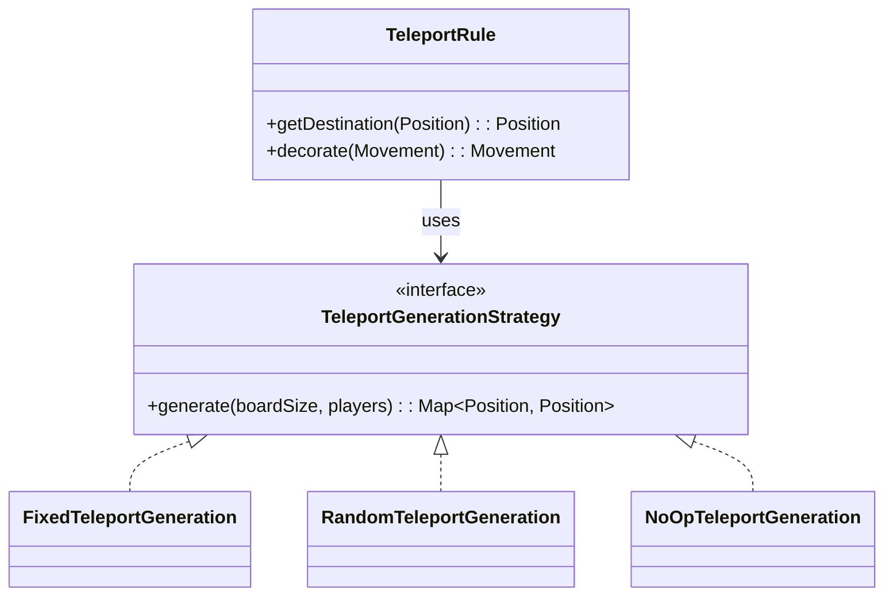
```mermaid
classDiagram
    TeleportGenerationStrategy <|.. FixedTeleportGeneration
    TeleportGenerationStrategy <|.. RandomTeleportGeneration
    TeleportGenerationStrategy <|.. NoOpTeleportGeneration

    TeleportRule --> TeleportGenerationStrategy : uses

    class TeleportRule {
        +getDestination(Position): Position
        +decorate(Movement): Movement
    }

    class TeleportGenerationStrategy {
        <<interface>>
        +generate(boardSize, players): Map~Position, Position~
    }

    class FixedTeleportGeneration

    class RandomTeleportGeneration

    class NoOpTeleportGeneration
```

### Why It Is Used

The game can generate teleport wormholes in different ways. This allows teleporting to be fixed, random, or disabled without changing the teleport rule itself.

### SOLID Principles 

#### Open/Closed 

New teleport generation methods can be added as new strategies.

#### Single Responsibility 

Teleport generation is separated from teleport movement behaviour.

#### Dependency Inversion 

`TeleportRule` depends on the `TeleportGenerationStrategy` abstraction.

## Strategy Pattern

Pattern is used in:

- `HitStrategy`
- `SamePositionHit`
- `HitRule`

### UML Diagram

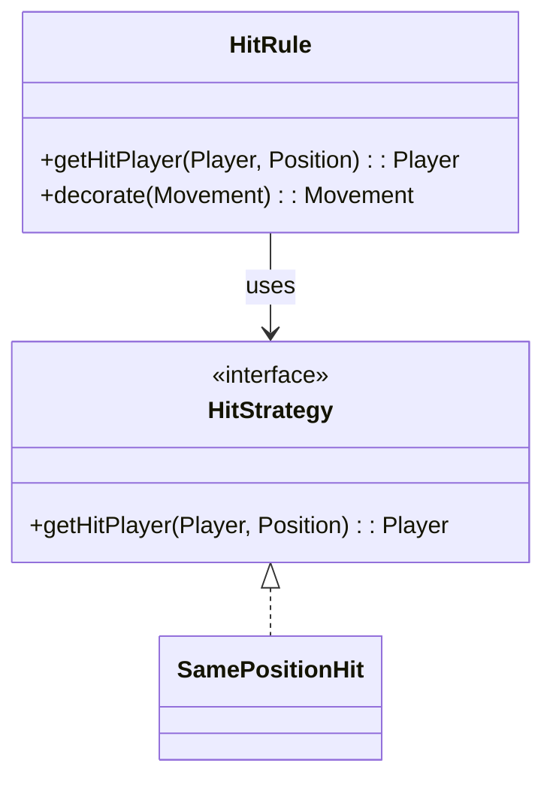
```mermaid
classDiagram
    HitStrategy <|.. SamePositionHit

    HitRule --> HitStrategy : uses

    class HitRule {
        +getHitPlayer(Player, Position): Player
        +decorate(Movement): Movement
    }

    class HitStrategy {
        <<interface>>
        +getHitPlayer(Player, Position): Player
    }

    class SamePositionHit
```

### Why It Is 

Hit detection is separated into a strategy so the rule can support different ways of checking collisions in the future.

### SOLID Principles 

#### Single Responsibility 

`SamePositionHit` only checks whether a player has landed on another player.

#### Open/Closed 

New hit detection algorithms can be added without changing `HitRule`.

#### Dependency Inversion 

`HitRule` depends on the `HitStrategy` interface.

Pattern is used in:

- `PathCalculationStrategy`
- `ForwardPathCalculation`
- `BackwardPathCalculation`
- `RotatedPathCalculation`
- `ReversedRotatedPathCalculation`
- `AbstractBoard`

### UML Diagram

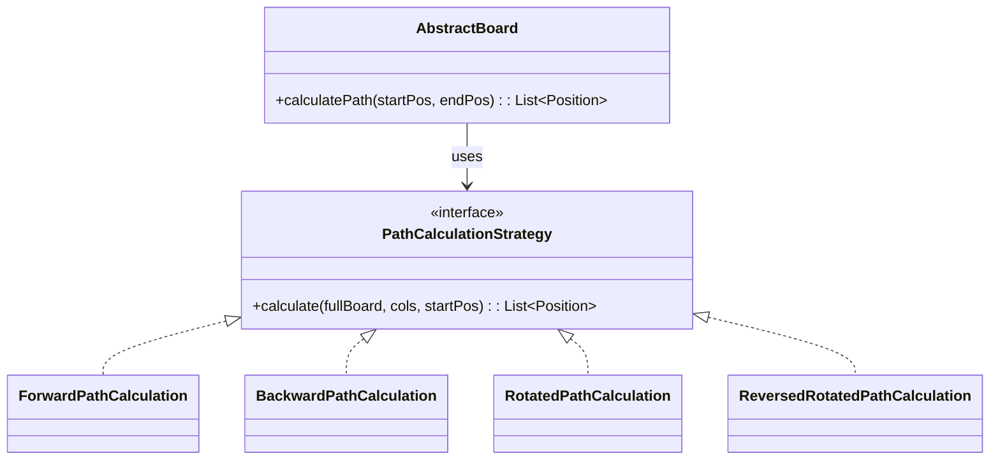
```mermaid
classDiagram
    PathCalculationStrategy <|.. ForwardPathCalculation
    PathCalculationStrategy <|.. BackwardPathCalculation
    PathCalculationStrategy <|.. RotatedPathCalculation
    PathCalculationStrategy <|.. ReversedRotatedPathCalculation

    AbstractBoard --> PathCalculationStrategy : uses

    class AbstractBoard {
        +calculatePath(startPos, endPos): List~Position~
    }

    class PathCalculationStrategy {
        <<interface>>
        +calculate(fullBoard, cols, startPos): List~Position~
    }

    class ForwardPathCalculation

    class BackwardPathCalculation

    class RotatedPathCalculation

    class ReversedRotatedPathCalculation
```

### Why It Is Used

Different players may need different board paths depending on their start and end positions. The Strategy Pattern allows path calculation to change without changing the board class.

### SOLID Principles 

#### Open/Closed 

New path calculations can be added as separate classes.

#### Single Responsibility 

Each path calculation class handles one path algorithm.

## Strategy Pattern: Player Positioning

### Type

Behavioural Design Pattern

### Where It Is Used

The Strategy Pattern is used in:

- `PlayerPositionStrategy`
- `TwoPlayerPosition`
- `FourPlayerPosition`
- `InitialisePlayerUseCase`

### UML Diagram

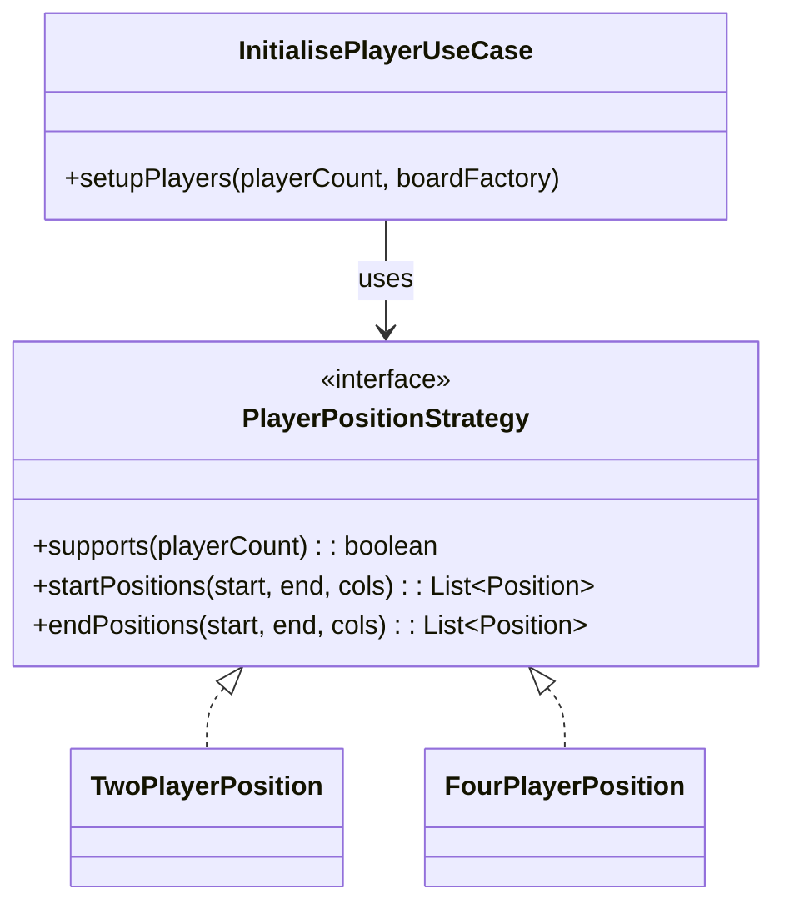
```mermaid
classDiagram
    PlayerPositionStrategy <|.. TwoPlayerPosition
    PlayerPositionStrategy <|.. FourPlayerPosition

    InitialisePlayerUseCase --> PlayerPositionStrategy : uses

    class InitialisePlayerUseCase {
        +setupPlayers(playerCount, boardFactory)
    }

    class PlayerPositionStrategy {
        <<interface>>
        +supports(playerCount): boolean
        +startPositions(start, end, cols): List~Position~
        +endPositions(start, end, cols): List~Position~
    }

    class TwoPlayerPosition

    class FourPlayerPosition
```

### Why It Is Used

The game needs different player start and end positions for two-player and four-player games. The Strategy Pattern avoids hardcoding all positioning logic inside the player setup class.

### SOLID Principles Used

#### Open/Closed Principle

New player count configurations can be added as new strategies.

#### Single Responsibility Principle

Each positioning strategy handles one player layout.

---

## Decorator Pattern

The Decorator Pattern allows gameplay variations to be layered on top of basic movement. For example, the game can use only basic movement, or combine exact-end, hit, and teleport variations together.

Pattern is used in:

- `Movement`
- `BasicMovement`
- `MovementDecorator`
- `ExactEndVariationDecorator`
- `HitVariationDecorator`
- `TeleportVariationDecorator`

### UML Diagram

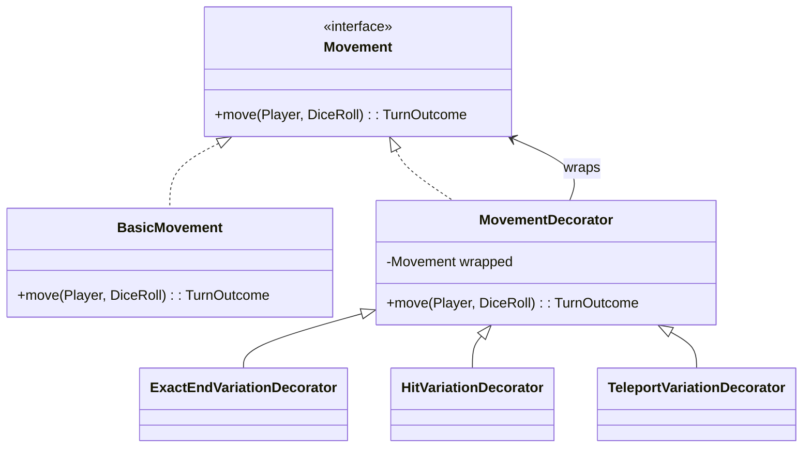
```mermaid
classDiagram
    Movement <|.. BasicMovement
    Movement <|.. MovementDecorator

    MovementDecorator --> Movement : wraps

    MovementDecorator <|-- ExactEndVariationDecorator
    MovementDecorator <|-- HitVariationDecorator
    MovementDecorator <|-- TeleportVariationDecorator

    class Movement {
        <<interface>>
        +move(Player, DiceRoll): TurnOutcome
    }

    class BasicMovement {
        +move(Player, DiceRoll): TurnOutcome
    }

    class MovementDecorator {
        -Movement wrapped
        +move(Player, DiceRoll): TurnOutcome
    }

    class ExactEndVariationDecorator

    class HitVariationDecorator

    class TeleportVariationDecorator
```

### SOLID Principles 

#### Open/Closed 

New movement rules can be added without editing `BasicMovement`.

#### Single Responsibility 

Each decorator handles one rule.

#### Liskov Substitution 

Each decorator implements `Movement`, so it can replace any other movement object.

## State Pattern

The State Pattern controls the lifecycle of the game without relying on procedural `if` or `switch` logic.

Pattern is used in:

- `GameState`
- `GameStateMachine`
- `ReadyState`
- `InPlayState`
- `GameOverState`

### UML Diagram

```mermaid
stateDiagram-v2
    [*] --> ReadyState

    ReadyState --> InPlayState : turn()
    InPlayState --> InPlayState : turn()
    InPlayState --> GameOverState : winner found
    GameOverState --> GameOverState : extra turn gives Game Over message
```

### SOLID Principles 

#### Single Responsibility 

Each state handles its own behaviour.

#### Open/Closed Principle

New states can be added without rewriting the whole state machine.

#### Liskov Substitution Principle

All states implement the same `GameState` interface.


## Observer Pattern

The Observer Pattern decouples game events from console output. The game does not need to know how events are displayed.

Pattern is used in:

- `TurnObserverPort`
- `GameStartedObserverPort`
- `GameEndedObserverPort`
- `GameSavedObserverPort`
- `ReplayObserverPort`
- `ConsoleTurnAdapter`
- `ConsoleGameStartedAdapter`
- `ConsoleGameEndedAdapter`
- `ConsoleGameSavedAdapter`
- `ConsoleReplayAdapter`

### UML Diagram

```mermaid
classDiagram
    TurnObserverPort <|.. ConsoleTurnAdapter
    GameStartedObserverPort <|.. ConsoleGameStartedAdapter
    GameEndedObserverPort <|.. ConsoleGameEndedAdapter
    GameSavedObserverPort <|.. ConsoleGameSavedAdapter
    ReplayObserverPort <|.. ConsoleReplayAdapter

    PlayerTurn --> TurnObserverPort : notifies
    GameSessionUseCase --> GameStartedObserverPort : notifies
    GameSessionUseCase --> GameEndedObserverPort : notifies
    GameSessionUseCase --> GameSavedObserverPort : notifies
    ReplayGameService --> ReplayObserverPort : notifies

    class PlayerTurn

    class GameSessionUseCase

    class ReplayGameService

    class TurnObserverPort {
        <<interface>>
    }

    class GameStartedObserverPort {
        <<interface>>
    }

    class GameEndedObserverPort {
        <<interface>>
    }

    class GameSavedObserverPort {
        <<interface>>
    }

    class ReplayObserverPort {
        <<interface>>
    }

    class ConsoleTurnAdapter

    class ConsoleGameStartedAdapter

    class ConsoleGameEndedAdapter

    class ConsoleGameSavedAdapter

    class ConsoleReplayAdapter
```

### SOLID Principles 

#### Single Responsibility 

Game logic produces events, while console adapters display them.

#### Open/Closed 

New observers can be added without changing the game session logic.

#### Dependency Inversion 

The game depends on observer interfaces, not console classes.

## Repository Pattern

The Repository Pattern separates game saving and loading from the main game logic.

Pattern is used in:

- `SavedGameRepository`
- `InMemorySavedGameRepositoryAdapter`
- `JsonFileSavedGameRepositoryAdapter`
- `SavedGame`

### UML Diagram

```mermaid
classDiagram
    SavedGameRepository <|.. InMemorySavedGameRepositoryAdapter
    SavedGameRepository <|.. JsonFileSavedGameRepositoryAdapter

    InMemorySavedGameRepositoryAdapter --> SavedGame : stores
    JsonFileSavedGameRepositoryAdapter --> SavedGame : stores

    class SavedGameRepository {
        <<interface>>
        +nextId()
        +save(SavedGame)
        +findById(id): SavedGame
        +findAll(): List~SavedGame~
    }

    class InMemorySavedGameRepositoryAdapter

    class JsonFileSavedGameRepositoryAdapter

    class SavedGame {
        +recordRoll(DiceRoll)
        +getConfiguration()
        +getDiceRolls()
    }
```

### SOLID Principles 

#### Dependency Inversion 

Use cases depend on `SavedGameRepository`, not file or memory storage directly.

#### Open/Closed 

New storage methods can be added without changing game or replay services.

#### Single Responsibility 

Repository classes only handle persistence.

# Overall Evaluation

The implementation successfully applies object-oriented design, clean architecture, and multiple design patterns to solve the requirements of the board game simulation.

## Strengths

### Maintainability

The code is split into clear responsibilities such as domain model, use cases, ports, and infrastructure adapters.

### Extensibility

The project can support new rules, dice types, boards, storage systems, and display systems with minimal changes to existing code.

### Testability

Because the application depends on interfaces, dependencies can be replaced with mocks or test doubles.

### Good Use of Design Patterns

The game uses patterns for real design problems:

- Factory for board and dice creation
- Strategy for interchangeable algorithms
- Decorator for combining movement rules
- State for lifecycle management
- Observer for event notifications
- Repository for save/replay persistence
- Adapter for infrastructure separation

### Good Use of SOLID

The most strongly demonstrated principles are:

- Single Responsibility Principle
- Open/Closed Principle
- Dependency Inversion Principle
- Liskov Substitution Principle

## Limitations

### More Classes and Complexity

Using several patterns increases the number of classes, which can make the project harder to understand at first.

### Console Interface Only

The current implementation uses console adapters. However, because of the architecture, a GUI or web interface could be added later.

### Some Behaviour Depends on Configuration

The game relies on correct wiring of strategies, decorators, observers, and adapters. This is flexible, but it also means configuration must be managed carefully.

## Conclusion

The game demonstrates a strong implementation of clean architecture and object-oriented design. The use of Ports and Adapters keeps the domain independent from infrastructure, while the design patterns make the game flexible enough to support the required variations and advanced features.

Overall, the implementation is scalable, maintainable, and suitable for extension.
