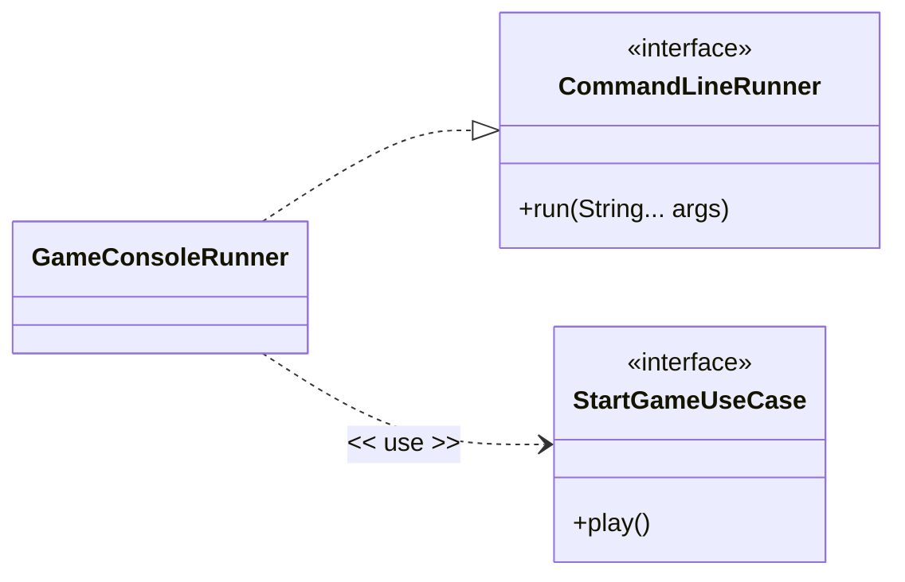
fdsfdsafdafdsfd
fdsfafdsfa

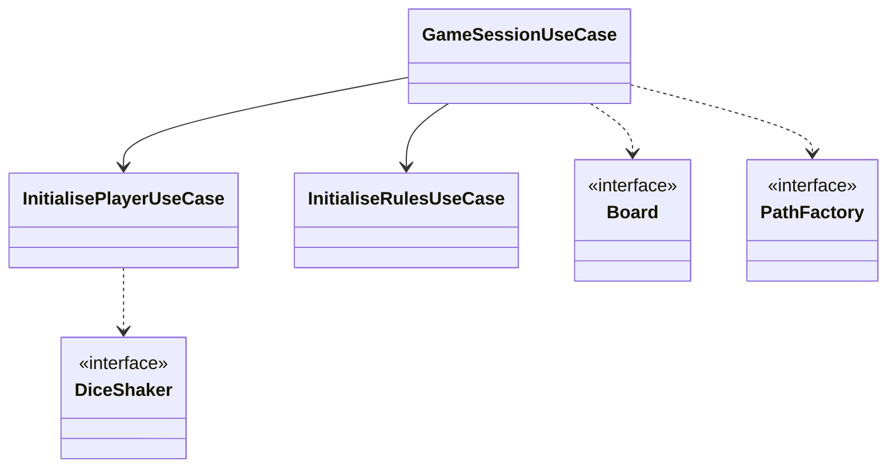
fdsafdsfds
fdafssdfdasaf


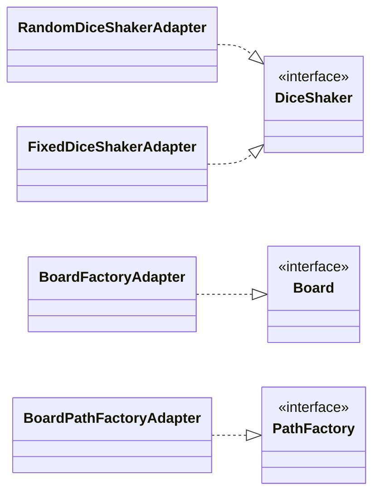

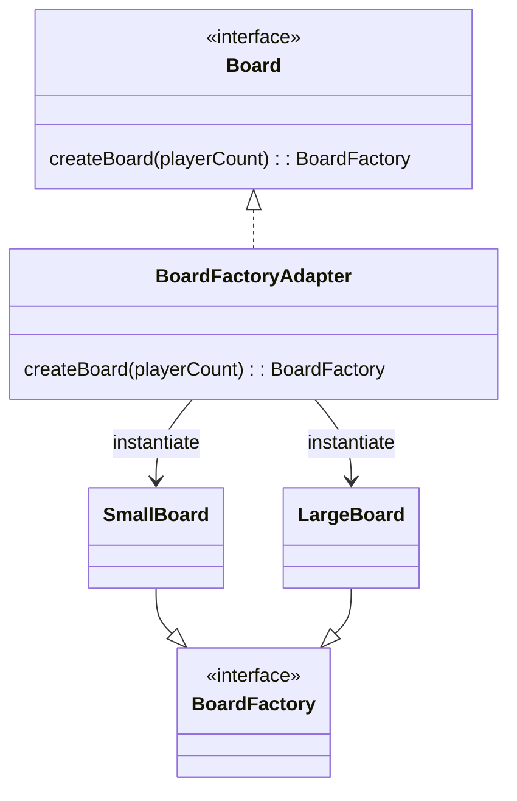

Board Factory Stuff

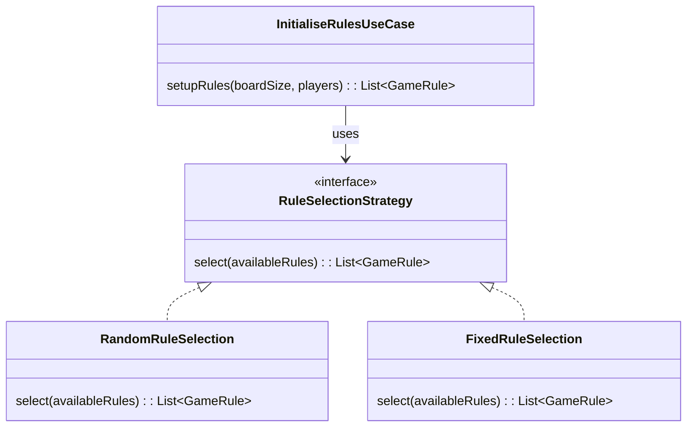

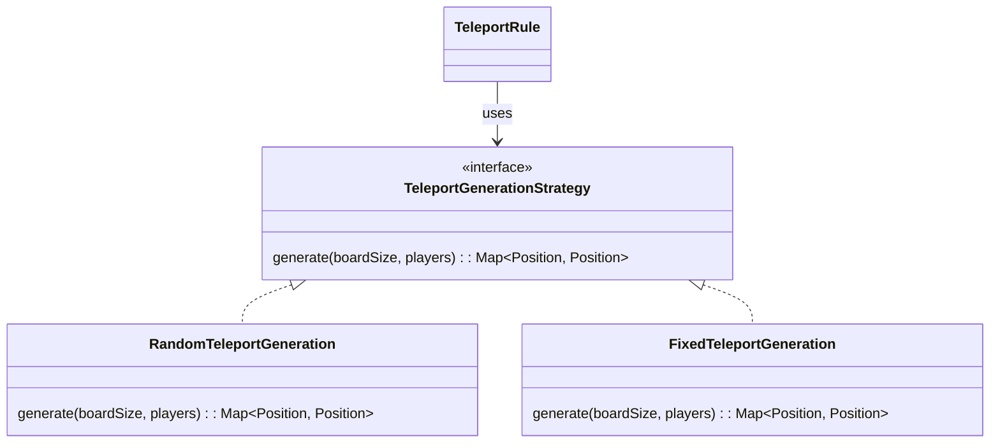

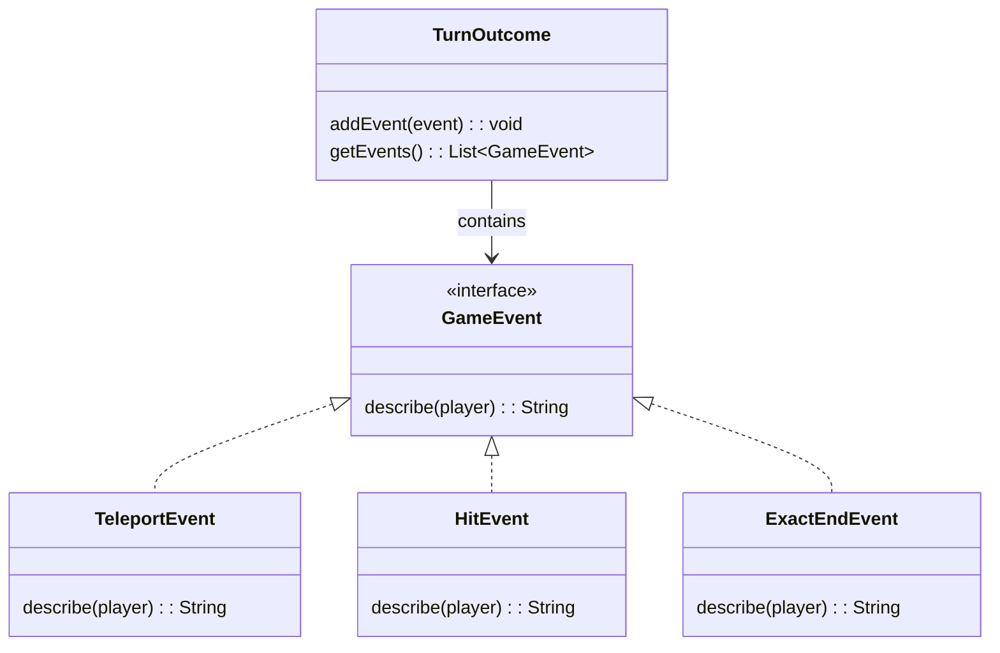

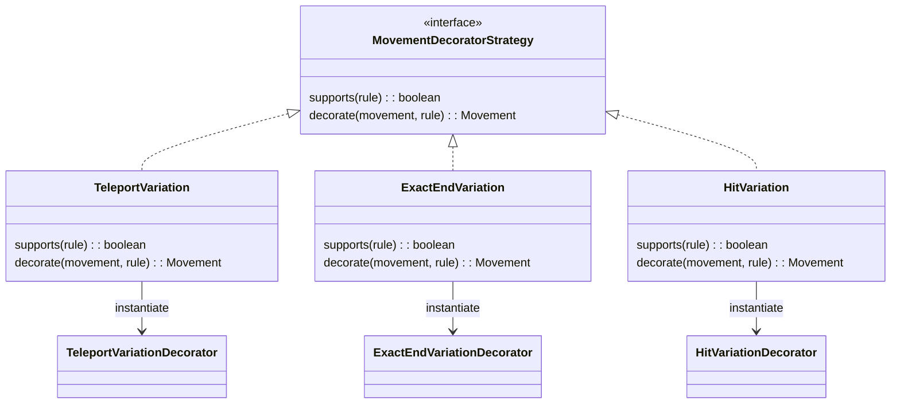

Strategy Stuff

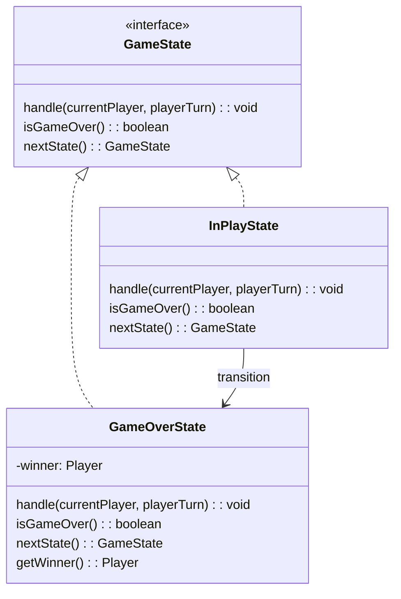

State stuff


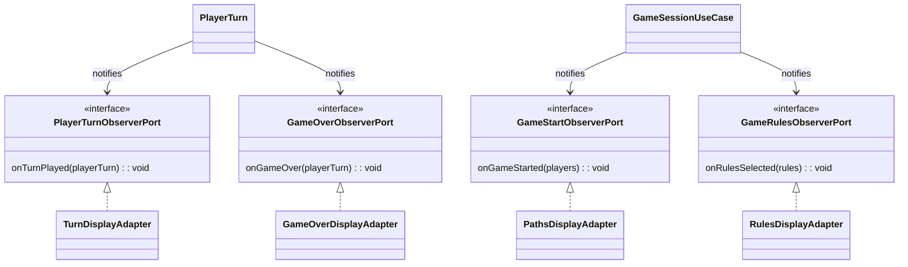

Observer Stuff

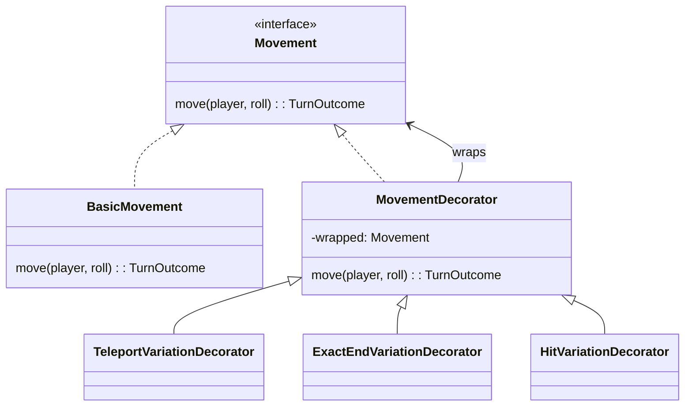

```mermaid
classDiagram
direction LR

    namespace Adapter {
        Board <|.. BoardFactoryAdapter
        BoardFactoryAdapter --> SmallBoard : instantiate
        BoardFactoryAdapter --> LargeBoard : instantiate
        SmallBoard --|> BoardFactory
        LargeBoard --|> BoardFactory

        class Board {
            <<interface>>
            createBoard(playerCount): BoardFactory
        }

        class BoardFactoryAdapter {
            createBoard(playerCount): BoardFactory
        }

        class BoardFactory {
            <<interface>>
        }

        class SmallBoard
        class LargeBoard
    }

    namespace TemplateMethod {
        BoardFactory <|.. AbstractBoard
        AbstractBoard <|-- SmallBoard
        AbstractBoard <|-- LargeBoard

        class AbstractBoard {
            #buildBoard(): List~Position~
            +getPositions(): List~Position~
            +getCols(): int
        }
    }
```