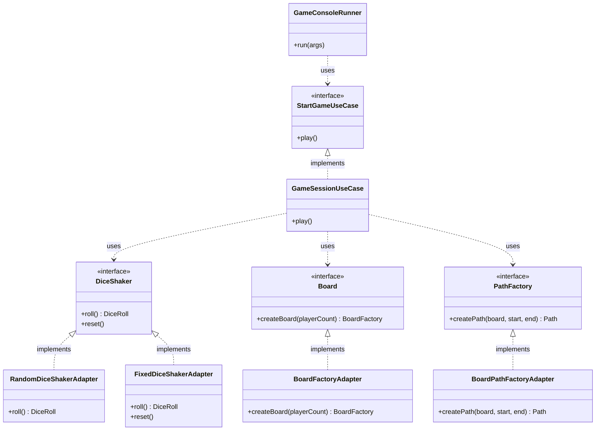
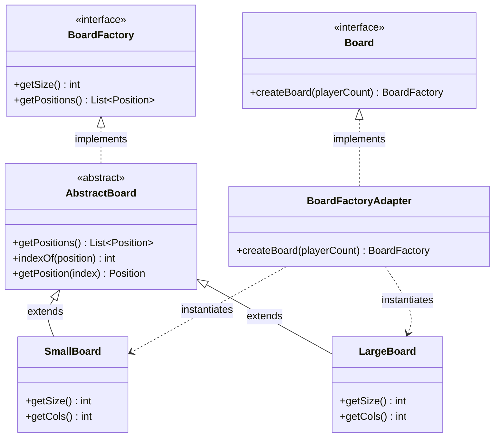
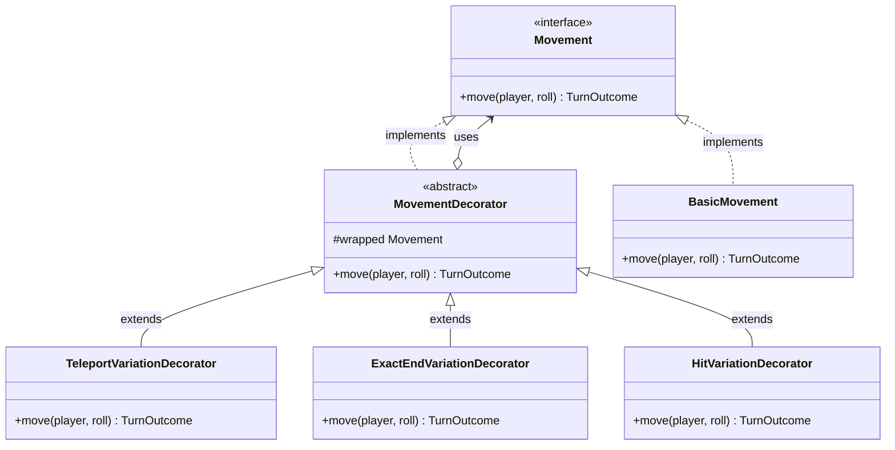
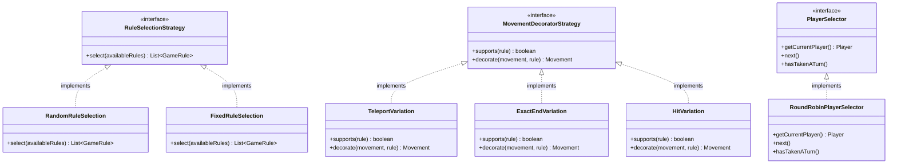
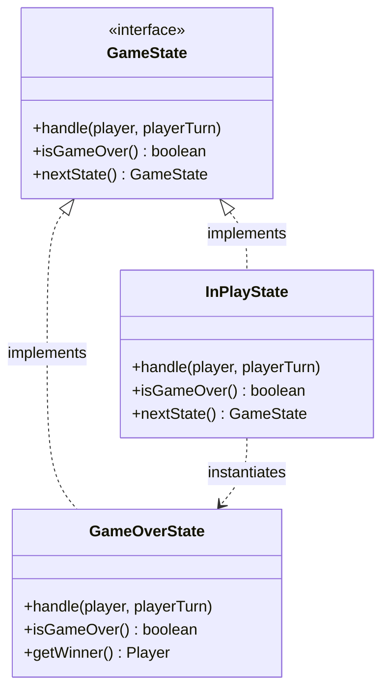
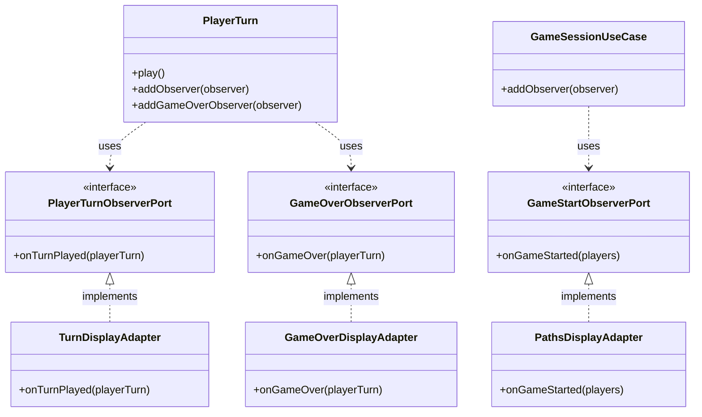
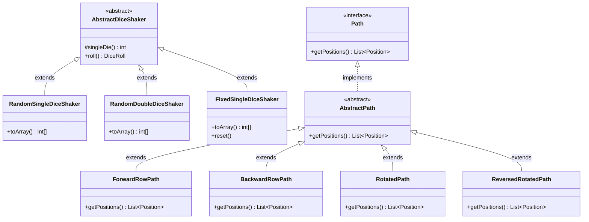

## Design Patterns

### Hexagonal Architecture (Ports & Adapters)

The core game logic has no knowledge of how it is driven or what external services it depends on. Inbound ports such as `StartGameUseCase` define what actions can be triggered, and outbound ports such as `DiceShaker`, `Board`, and `PathFactory` define what the application needs from the outside world. `GameConsoleRunner` drives the application by using the inbound port, while concrete adapters in the infrastructure layer implement the outbound ports. Swapping the console for a UI, or a real dice shaker for a fixed test one, requires no changes to the domain.

---

### Factory Pattern

`BoardFactoryAdapter` implements the `Board` port and acts as a factory, selecting either `SmallBoard` or `LargeBoard` based on the player count passed in. Both board types extend `AbstractBoard`, which provides the shared position list logic, with each subclass supplying its own grid layout and dimensions.

---

### Decorator Pattern

`BasicMovement` handles a standard move by advancing the player along their path by the dice roll total. Each active game rule wraps this in a decorator — `TeleportVariationDecorator`, `ExactEndVariationDecorator`, and `HitVariationDecorator` — that adds its own behaviour around the delegate call. This allows any combination of rules to be layered onto the movement pipeline at runtime without modifying existing classes.

---

### Strategy Pattern

Three separate strategy hierarchies are used. `RuleSelectionStrategy` controls which rules are active for a session — `RandomRuleSelection` picks a random subset while `FixedRuleSelection` uses a predetermined list. `MovementDecoratorStrategy` controls how each rule is applied to the movement pipeline, with each implementation knowing which rule it supports and how to decorate it. `PlayerSelector` controls turn order, with `RoundRobinPlayerSelector` cycling through players in sequence.

---

### State Pattern

The game progresses through two states: `InPlayState` and `GameOverState`, both implementing the `GameState` interface. After each turn `InPlayState` checks whether the current player has reached the end of their path, and if so instantiates a `GameOverState` and returns it from `nextState()`. The game loop in `PlayerTurn` simply calls `isGameOver()` each round with no conditional logic about which state it is in.

---

### Observer Pattern

Three observer ports — `PlayerTurnObserverPort`, `GameOverObserverPort`, and `GameStartObserverPort` — allow the domain to broadcast events without knowing who is listening. The infrastructure display adapters register themselves and react by printing output to the console. Adding a new output target such as a file logger or a UI requires only a new adapter implementing the relevant port, with no changes to the domain.

---

### Template Method Pattern

Two Template Method hierarchies exist. `AbstractDiceShaker` defines the algorithm for rolling — calling `toArray()` and wrapping the result in a `DiceRoll` — leaving the die values to each subclass. `AbstractPath` similarly defines path storage and retrieval, with each subclass providing a differently oriented sequence of positions on the board. The shared logic is written once in the abstract class and never repeated.