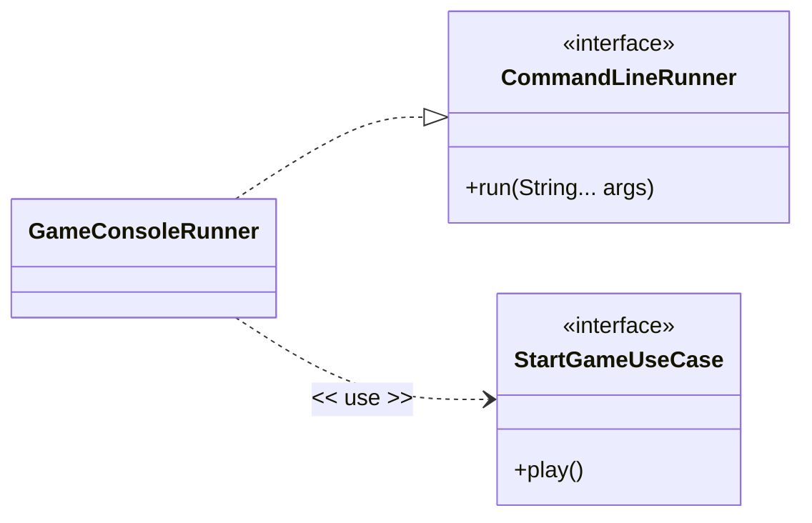
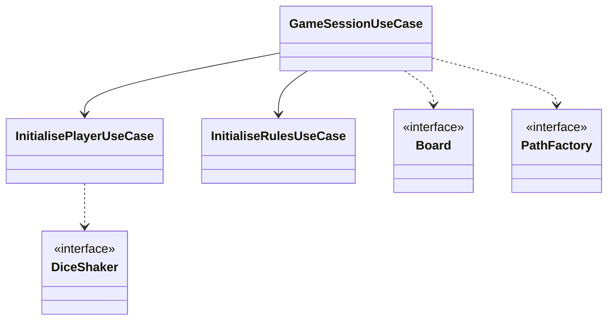
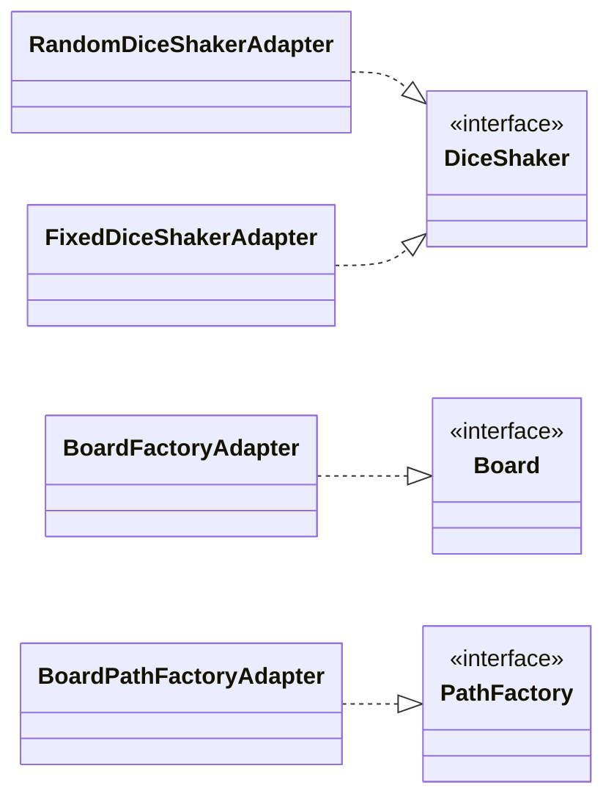

```mermaid
classDiagram
direction LR

class GameConsoleRunner
class CommandLineRunner {
    <<interface>>
    +run(String... args)
}

class StartGameUseCase {
    <<interface>>
    +play()
}

GameConsoleRunner ..|> CommandLineRunner
GameConsoleRunner ..> StartGameUseCase : << use >>
```
fdsfdsafdafdsfd
fdsfafdsfa

```mermaid
classDiagram
direction TB

class GameSessionUseCase
class InitialisePlayerUseCase
class InitialiseRulesUseCase

class Board {
    <<interface>>
}

class PathFactory {
    <<interface>>
}

class DiceShaker {
    <<interface>>
}

GameSessionUseCase --> InitialisePlayerUseCase
GameSessionUseCase --> InitialiseRulesUseCase

GameSessionUseCase ..> Board
GameSessionUseCase ..> PathFactory

InitialisePlayerUseCase ..> DiceShaker
```
fdsafdsfds
fdafssdfdasaf

```mermaid
classDiagram
direction LR

class DiceShaker {
    <<interface>>
}

class Board {
    <<interface>>
}

class PathFactory {
    <<interface>>
}

class RandomDiceShakerAdapter
class FixedDiceShakerAdapter
class BoardFactoryAdapter
class BoardPathFactoryAdapter

RandomDiceShakerAdapter ..|> DiceShaker
FixedDiceShakerAdapter ..|> DiceShaker

BoardFactoryAdapter ..|> Board
BoardPathFactoryAdapter ..|> PathFactory
```

fdsfddfdsf